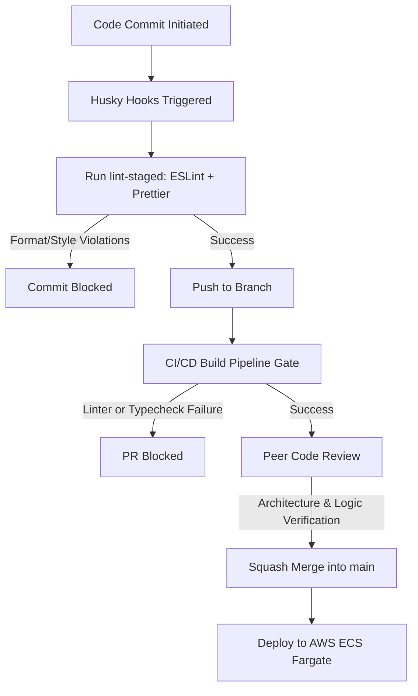
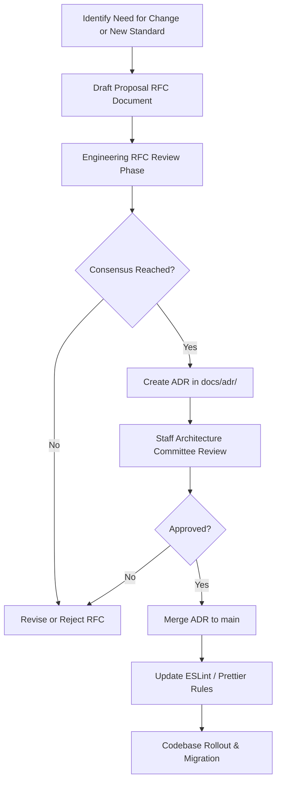

# ADR-002: Establish Centralized Engineering Standards and Conventions

> **Document Status:** Approved  
> **Version:** 1.0.0  
> **Date:** 2026-07-13  
> **Authors:** Architecture Team  
> **Approvers:** Staff Architecture Committee, DevOps Engineering Lead,
> Engineering Excellence Lead  
> **Related ADRs:**
> [ADR-001: Establish Repository and Engineering Conventions](./ADR-001-repository-conventions.md)  
> **Related
> Documents:**
> [TypeScript Style Guide](../engineering/typescript-style-guide.md),
> [Naming Conventions](../engineering/naming-conventions.md),
> [Error Handling](../engineering/error-handling.md),
> [Logging Standards](../engineering/logging-standards.md),
> [API Guidelines](../engineering/api-guidelines.md),
> [Database Conventions](../engineering/database-conventions.md),
> [Event Schema](../engineering/event-schema.md),
> [Documentation Standards](../engineering/documentation-standards.md),
> [Prettier Formatting Standards](../engineering/prettier-formatting-standards.md)  
> **Tags:**
> Architecture Governance, Code Quality, Observability, Standards

---

## Executive Summary

CommerSync is an enterprise e-commerce platform designed to scale to 15+ backend
microservices, multiple frontend applications, and shared monorepo packages. As
the engineering team expands, maintaining high code quality and operational
safety requires unified engineering rules.

This ADR records the decision to adopt and enforce mandatory, centralized
engineering standards and conventions across the entire CommerSync platform.
These standards cover code formatting, naming, error structures, API models,
database schemas, messaging formats, and system documentation. By establishing
these rules at Phase 2—before writing application logic—we establish a stable
architecture baseline that cuts onboarding times, guarantees production
observability, and prevents architectural drift.

---

## 1. Context & Problem Statement

### 1.1 Context

In a Turborepo-managed monorepo with multiple teams, shared packages, and
cross-boundary dependencies, engineering standards are critical. Without strict
guidelines, as the codebase grows:

- Different teams implement conflicting coding styles (e.g., custom error
  classes vs. generic exceptions, different casing for directory layouts, or
  inconsistent REST endpoints).
- Logs are formatted differently across services, which blocks centralized
  parsing, searching, and distributed tracing.
- Database schemas drift in style (mixed use of camelCase and snake_case in
  PostgreSQL columns).

### 1.2 Problem Statement

Without early, centralized engineering standards, CommerSync will face several
scaling challenges:

1.  **High Cognitive Load:** Engineers switching between services must adapt to
    varying coding styles.
2.  **Inconsistent APIs & Serialization:** Frontend clients must write custom
    parsing wrappers for each service due to varying success and error response
    formats.
3.  **Fragmented Observability:** Centralized SRE tools cannot track requests
    across services due to non-standard logging properties and missing trace
    headers.
4.  **Inefficient Code Reviews:** Pull request reviews focus on style debates
    rather than logic correctness, architecture constraints, and testing
    coverage.

---

## 2. Decision

CommerSync adopts a mandatory set of **Centralized Engineering Standards &
Conventions** that applies to every application, service, package,
configuration, and documentation file. Specifically:

1.  **TypeScript Standards:** Strict type safety (no implicit any, strict null
    checks, exact optional property types, no unchecked indexed access) is
    enforced globally.
2.  **Naming Conventions:** kebab-case for files, PascalCase for React
    components, camelCase for custom hooks, and UPPER_SNAKE_CASE for constants.
3.  **Error Handling Standards:** Explicit custom exception classes inheriting
    from a base `AppError` returning standard JSON envelopes with
    machine-readable error codes.
4.  **Logging Standards:** Mandatory JSON structured logging with unified trace
    propagation (`traceId`, `correlationId`, `requestId`) and strict PII data
    masking.
5.  **API Design Guidelines:** Resource-oriented REST endpoints using plural
    nouns, kebab-case path parameters, and standardized success/error JSON
    response wrappers.
6.  **Database Conventions:** Lowercase snake_case in PostgreSQL tables and
    columns; Prisma models explicitly mapped using `@map` and `@@map` attributes
    to preserve TypeScript camelCase naming.
7.  **Event Schema Conventions:** Lowercase snake_case dot-notation event names
    (`order.orders.created`); standard envelopes with trace metadata; partition
    keys matching entity aggregate IDs.
8.  **Documentation Standards:** Mandatory README files for all
    services/packages; ADRs for architectural decisions; Markdown formatting
    guidelines.

---

## 3. Decision Flow & Workflows

### 3.1 Standards Review & Enforcement Pipeline

### 3.2 Standards Governance & Proposal Workflow

---

## 4. Alternatives Considered

### Alternative A: No Engineering Standards

- **Description:** Allow individual engineers to write code in their preferred
  style.
- **Why Rejected:** Creates high maintenance debt, fragmented logs, and
  subjective reviews.

### Alternative B: Team-Specific Standards

- **Description:** Allow each team to define standards for their own
  microservices.
- **Why Rejected:** Downstream clients and shared packages must conform to
  varying rules, leading to integration issues.

### Alternative C: CENTRALIZED STANDARDS (Chosen)

- **Description:** Enforce mandatory standards across the entire repository.
- **Why Selected:** Enforces a single style across the platform, standardizes
  APIs and error handling, and provides consistent observability.

---

## 5. Consequences

### Positive Consequences

- **Atomic Integrations:** Client apps consume downstream microservices with
  zero API contract variance.
- **Unified Monitoring:** Log aggregation and distributed tracing work out of
  the box.
- **Small, Clean Diff Histories:** Standardized formatting and styling minimize
  Git merge conflicts.
- **Faster Onboarding:** Self-documenting, uniform patterns reduce developer
  ramp-up time.

### Trade-offs & Negative Consequences

- **Initial Setup Overhead:** Tooling configurations (TSConfigs, ESLint flat
  files, Prettier, Husky) require upfront integration effort.
- **Strict Compiler Gates:** Strict TypeScript settings (like
  `noUncheckedIndexedAccess`) require more explicit validation code.

---

## 6. Enforcement & Enforcement Matrix

Compliance is verified automatically at every step of the development cycle:

| Area                           | Enforcement Tool                | Stage           | Action on Failure     |
| ------------------------------ | ------------------------------- | --------------- | --------------------- |
| **Formatting**                 | Prettier                        | Pre-commit / CI | Blocks Commit / Build |
| **Linting**                    | ESLint                          | Pre-commit / CI | Blocks Commit / Build |
| **Type Safety**                | TypeScript compiler (`tsc`)     | CI              | Blocks Merge          |
| **API/Database/Event Schemas** | Schema Registry & Prisma format | Commit / CI     | Blocks Merge          |
| **Architectural Boundaries**   | CODEOWNERS & Peer Review        | PR Review       | Blocks Merge          |

---

## 7. FAQ

### Q: Can standards be changed?

Yes. Standards are living agreements. If a rule is obsolete or needs adjustment,
draft a proposal RFC following the
[Governance Workflow](#32-standards-governance--proposal-workflow). Once
approved, write a new ADR to update or supersede the relevant standard.

### Q: How do we handle exceptions?

If a third-party API or legacy integration requires a styling variance:

1. Document the exception in the local code using inline comments explaining
   **why** the standard is bypassed.
2. Obtain approval from the Technical Lead during PR review.
