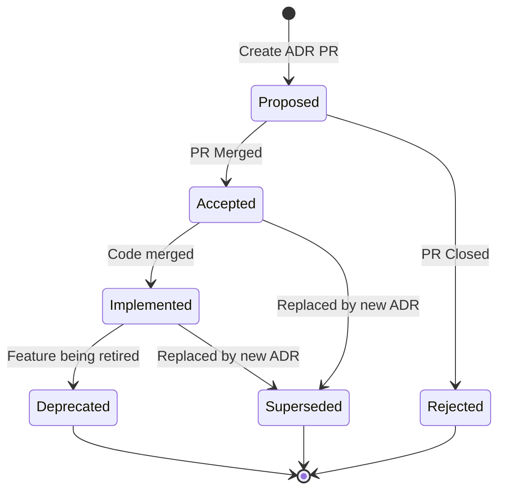
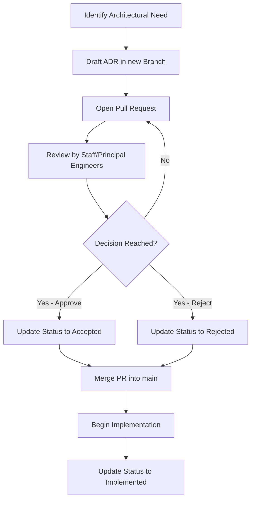

# Architecture Decision Records (ADRs)

> **Document Status:** Approved  
> **Project:** CommerSync  
> **Version:** 1.0.0  
> **Audience:** All Contributors, Engineers, Tech Leads, Staff Engineers  
> **Applies To:** Entire Repository

---

## 1. What are ADRs?

An **Architecture Decision Record (ADR)** is a short text file in a format
similar to an Alexandrian pattern that describes a set of forces and a single
decision in response to those forces.

ADRs represent the project's **immutable architectural history**. They capture
the business context, technical context, and the rationale behind significant
architectural choices. Once an ADR is accepted, it is rarely modified; instead,
if a decision changes, a new ADR is created to supersede the old one.

---

## 2. Why ADRs Exist

At CommerSync, engineering excellence relies on clear communication and
long-term maintainability. As an enterprise-scale platform with multiple
services and teams, knowledge silos are a significant risk.

ADRs exist to:

- **Preserve Engineering Knowledge:** Prevent tribal knowledge by permanently
  recording why decisions were made.
- **Provide Context for Future Contributors:** Enable new engineers to
  understand the evolution of the system without requiring senior engineers to
  repeatedly explain past decisions.
- **Capture Rejected Alternatives:** Document _why_ certain paths were avoided,
  preventing teams from inadvertently revisiting bad ideas in the future.
- **Enable Asynchronous Review:** Allow architectural proposals to be reviewed,
  debated, and approved through Pull Requests.
- **Decentralize Decision Making:** Provide a structured framework for any
  engineer to propose architectural changes.

---

## 3. When to Create an ADR

An ADR should be created whenever a decision has a significant impact on the
architecture, non-functional requirements, or engineering workflow of the
CommerSync platform.

**Create an ADR for:**

- Adopting a new framework, library, or core technology.
- Designing a new microservice boundary.
- Defining a cross-cutting concern (e.g., how logging, authentication, or
  tracing is handled).
- Changing data storage strategies or database technologies.
- Introducing a new design pattern or architectural style (e.g., CQRS, Event
  Sourcing).
- Significant changes to the CI/CD pipeline or deployment strategy.

---

## 4. When an ADR is Unnecessary

ADRs are not meant for trivial changes or implementation details that do not
affect the broader system.

**Do NOT create an ADR for:**

- Standard feature implementations following established patterns.
- Minor library version upgrades.
- Refactoring that does not change the external interface or system
  architecture.
- Decisions already covered by existing ADRs.
- Ephemeral changes or experimental spikes (unless the spike results in a
  permanent architectural decision).

---

## 5. ADR Lifecycle and Status Definitions

An ADR flows through a specific lifecycle, represented by its status.



### Status Definitions:

- **Proposed:** The ADR is currently under review in a Pull Request. It is open
  for discussion, modification, and feedback.
- **Accepted:** The architectural decision has been approved and the PR merged.
  Teams can now build upon this decision.
- **Implemented:** The code or infrastructure reflecting the decision has been
  successfully deployed to production.
- **Deprecated:** The decision or the technology it mandates is being phased
  out, but is still present in the system.
- **Superseded:** A new ADR has completely replaced this decision. The ADR must
  link to the new ADR that supersedes it.
- **Rejected:** The proposal was not accepted. The ADR is still merged or kept
  in the record to document _why_ the idea was rejected, preventing future
  duplication of effort.
- **Cancelled:** The proposal was withdrawn by the author before a decision was
  reached.

---

## 6. ADR Numbering Strategy

ADRs follow a strict, sequential numbering scheme: `ADR-NNN-short-title.md`.

- Start at `ADR-000` (reserved for the template).
- Increment by 1 for each new ADR (`ADR-001`, `ADR-002`, etc.).
- Use descriptive, hyphenated short titles.

**CRITICAL RULE:** An ADR number is **never reused**. If an ADR is rejected,
superseded, or deleted, its number is permanently retired. This ensures that
external references (e.g., in Jira, Slack, or code comments) to "ADR-014" never
suddenly point to a completely different decision.

### Examples:

- `ADR-000-template.md`
- `ADR-001-repository-conventions.md`
- `ADR-002-authentication-strategy.md`

---

## 7. Directory Organization

All ADRs are stored in the `docs/adr/` directory at the root of the repository.

```
CommerSync/
└── docs/
    └── adr/
        ├── README.md
        ├── ADR-000-template.md
        ├── ADR-001-repository-conventions.md
        └── ADR-002-authentication-strategy.md
```

---

## 8. How ADRs Evolve Over Time

ADRs are immutable records of a decision made _at a specific point in time_.

When a decision needs to change because the business context or technology
landscape has shifted:

1. **Do not** heavily edit the original ADR to reflect the new reality.
2. **Do** create a new ADR (e.g., `ADR-045`) detailing the new decision.
3. **Do** update the status of the old ADR to **Superseded** and add a link to
   the new ADR.

This preserves the historical context of _why_ the original decision was made,
while clearly pointing to the current standard.

---

## 9. Architecture Governance Workflow

The process of moving an ADR from proposal to implementation involves the
broader engineering organization.



---

## 10. Suggested Future ADR Topics

To build a robust architectural foundation for CommerSync, the following topics
should be addressed in upcoming ADRs:

- **Authentication Architecture:** How users authenticate, session management,
  and token exchange.
- **Database Strategy:** Polyglot persistence choices (PostgreSQL vs. DynamoDB
  vs. Redis).
- **Event Bus:** Selection of message broker (e.g., Kafka) and event schema
  registry.
- **API Gateway:** Routing, rate limiting, and edge security.
- **Observability:** Centralized logging, distributed tracing, and metrics
  collection.
- **Secrets Management:** How sensitive configuration is injected into services
  securely.
- **Testing Strategy:** Standards for unit, integration, and E2E testing across
  the monorepo.
- **Deployment Strategy:** Blue/Green vs. Canary deployments on AWS ECS Fargate.
