# Branch Strategy

> **Document Status:** Approved  
> **Project:** CommerSync  
> **Version:** 1.0.0  
> **Audience:** All Contributors, Engineers, Tech Leads, Staff Engineers  
> **Applies To:** Entire Repository

---

# Table of Contents

1. Introduction
2. Purpose of this Handbook
3. Engineering Philosophy
4. Why Source Control Matters
5. Understanding Git Internals
6. What is a Git Branch?

---

# 1. Introduction

Git is more than a tool for storing code—it is the foundation of how modern software teams collaborate, review changes, release software, and recover from failures.

As CommerSync grows into an enterprise-scale platform, maintaining a consistent branching strategy becomes essential. A predictable workflow reduces merge conflicts, improves code quality, enables continuous integration, and ensures every engineer follows the same development process.

This handbook defines the official Git branching strategy for the CommerSync repository. Every contributor, regardless of experience level, is expected to follow these standards.

---

# 2. Purpose of this Handbook

The goal of this handbook is to establish a single source of truth for how code changes move from a developer's machine to production.

Specifically, this document explains:

- Why Git matters
- How Git works internally
- Why CommerSync uses Trunk-Based Development
- How feature branches should be created
- Pull Request expectations
- Branch naming conventions
- Merge strategy
- CI/CD integration
- Best practices for collaboration

By following these standards, we achieve:

- Faster development cycles
- Fewer merge conflicts
- Predictable releases
- Consistent commit history
- Reliable deployments
- Easier onboarding for new engineers

---

# 3. Engineering Philosophy

CommerSync follows a modern engineering workflow based on four core principles.

## Small Changes

Large changes are difficult to review, test, and merge. Every Pull Request should solve a single problem and remain focused.

✅ Good

- Add user login API
- Fix cart calculation bug
- Improve Redis caching

❌ Bad

- Authentication + Orders + Payments + Refactoring + Documentation

---

## Continuous Integration

Code should be integrated into the main branch frequently rather than living in long-running branches.

Frequent integration:

- reduces merge conflicts
- keeps everyone working on the latest code
- allows automated testing to detect issues early

---

## Automation First

Any task that can be automated should not rely on manual execution.

Examples include:

- linting
- formatting
- testing
- security scanning
- Docker builds
- deployments

Automation improves consistency and reduces human error.

---

## Main is Always Deployable

The `main` branch should always represent production-ready code.

Every commit merged into `main` must:

- compile successfully
- pass automated tests
- pass code review
- satisfy quality checks

At any point, the latest commit on `main` should be safe to deploy.

---

# 4. Why Source Control Matters

Before Git, developers often shared code manually or used centralized version control systems, making collaboration slow and error-prone.

Git solves these problems by providing:

- complete change history
- collaboration across teams
- branching and experimentation
- safe rollbacks
- distributed development

## Benefits of Source Control

| Benefit       | Description                                 |
| ------------- | ------------------------------------------- |
| History       | Every change is recorded.                   |
| Collaboration | Multiple engineers can work simultaneously. |
| Recovery      | Previous versions can be restored.          |
| Traceability  | Every change has an author and timestamp.   |
| Code Review   | Changes can be reviewed before merging.     |

Without version control:

- accidental overwrites become common
- deployments become risky
- debugging becomes difficult
- collaboration slows dramatically

Git enables engineering teams to move quickly while maintaining confidence in every change.

---

# 5. Understanding Git Internals

A basic understanding of Git internals helps explain why our branching strategy works.

## Repository

A Git repository stores the complete history of a project, including commits, branches, tags, and configuration.

```
Repository
│
├── Commits
├── Branches
├── Tags
└── History
```

Every developer has a complete copy of the repository on their local machine.

---

## Working Tree

The Working Tree contains the files you are actively editing.

Changes made here are not tracked until they are staged.

```
Repository

↓

Working Tree

↓

Modified Files
```

---

## Staging Area (Index)

Before creating a commit, changes are placed into the staging area.

```
Working Tree

↓

git add

↓

Staging Area

↓

git commit

↓

Repository
```

This allows developers to choose exactly which changes belong in a commit.

---

## Commit

A commit is a snapshot of the project at a specific point in time.

Each commit includes:

- unique SHA identifier
- author
- timestamp
- commit message
- reference to its parent commit

Example:

```
A → B → C → D
```

Each letter represents a commit in the repository history.

---

## HEAD

`HEAD` represents your current position in the repository.

When switching branches, HEAD moves to the latest commit on that branch.

```
main

A → B → C ← HEAD
```

---

## Branch Reference

A branch is simply a named reference pointing to the latest commit.

```
main

A → B → C
         ↑
       main
```

When a new commit is created, the branch pointer moves forward.

```
A → B → C → D
             ↑
           main
```

---

## Merge

When two branches diverge, Git combines their histories through a merge.

```
A → B → C
     \
      D → E

↓

Merge

↓

A → B → C → M
     \     /
      D → E
```

Git preserves the history of both branches.

---

# 6. What is a Git Branch?

One of the biggest misconceptions about Git is that a branch is a copy of the project.

It is not.

A Git branch is simply a lightweight pointer to a commit.

```
main

A → B → C
         ↑
       main
```

Creating a new branch does **not** duplicate files.

Instead, Git creates another reference.

```
A → B → C
         ↑
      main

         ↑
   feature/auth-service
```

When development continues on the feature branch:

```
main

A → B → C

feature/auth-service

A → B → C → D → E
```

The `main` branch remains unchanged until the feature branch is merged.

---

## Why Deleting a Branch Does Not Delete Code

After merging:

```
A → B → C → D → E
                 ↑
               main

feature/auth-service
```

Both branches reference the same commit history.

Deleting the feature branch only removes the branch name.

```
A → B → C → D → E
                 ↑
               main
```

The commits remain part of the repository because they are still reachable through `main`.

This is why deleting merged feature branches is safe and encouraged.

---

## Key Takeaways

- A branch is a pointer, not a copy.
- Commits store the actual project history.
- HEAD represents your current working location.
- The staging area allows selective commits.
- Git repositories contain the complete project history.
- Deleting a merged branch does not remove its commits.
- Understanding these concepts makes advanced Git workflows much easier to reason about.

---

# 7. History of Branching Strategies

Software development has evolved significantly over the years, and so have branching strategies. Each strategy was designed to solve collaboration problems for teams of its time.

Understanding this evolution helps explain why CommerSync adopts **Trunk-Based Development**.

## Centralized Version Control

Older systems like SVN and CVS used a single central repository where developers committed directly to the main codebase.

```
Developer A
      │
Developer B
      │
Developer C
      │
      ▼
Central Repository
```

### Advantages

- Simple workflow
- Easy to understand
- Minimal branching

### Disadvantages

- High risk of breaking the main codebase
- Difficult parallel development
- Frequent integration issues
- Limited scalability

As engineering teams grew, this approach became difficult to maintain.

---

## Git Flow

Git Flow introduced multiple long-lived branches to separate development, releases, and hotfixes.

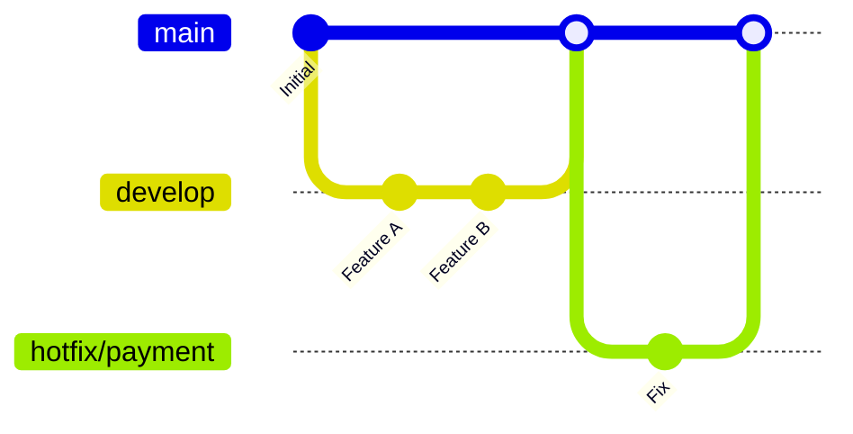

### Permanent Branches

- `main`
- `develop`

Additional temporary branches:

- feature/\*
- release/\*
- hotfix/\*

### Advantages

- Structured release process
- Clear separation of development and production

### Disadvantages

- Long-lived branches
- Large merge conflicts
- Slow release cycles
- High maintenance overhead

Git Flow works well for scheduled releases but is less suitable for continuous deployment.

---

## GitHub Flow

GitHub Flow simplified the workflow considerably.

```
main
 │
 ├── feature/auth
 │        │
 │        ▼
 │     Pull Request
 │        │
 └────────┘
      ▼
    Deploy
```

### Workflow

1. Create a feature branch.
2. Develop the feature.
3. Open a Pull Request.
4. Merge into `main`.
5. Deploy.

### Advantages

- Simple
- Fast
- Continuous delivery friendly

### Limitations

- Doesn't prescribe release strategies.
- Requires strong CI/CD practices.

---

## GitLab Flow

GitLab Flow extends GitHub Flow by introducing environment-aware workflows.

```
main
 │
 ├── Production
 ├── Staging
 └── Development
```

This works well for organizations with multiple deployment environments but introduces additional branch management complexity.

---

## Trunk-Based Development

Trunk-Based Development (TBD) minimizes branching and encourages developers to integrate small changes into the main branch frequently.

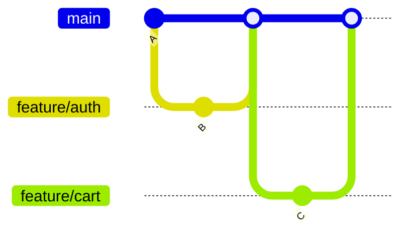

Feature branches are:

- Short-lived
- Small
- Frequently merged
- Deleted immediately after merge

This is the strategy adopted by CommerSync.

---

## Strategy Comparison

| Strategy                | Long-lived Branches | Merge Complexity | Release Speed | Recommended Today  |
| ----------------------- | ------------------- | ---------------- | ------------- | ------------------ |
| Centralized VCS         | No                  | Low              | Slow          | ❌                 |
| Git Flow                | Yes                 | High             | Medium        | ⚠️ Legacy Projects |
| GitHub Flow             | No                  | Low              | Fast          | ✅                 |
| GitLab Flow             | Few                 | Medium           | Fast          | ✅                 |
| Trunk-Based Development | No                  | Very Low         | Very Fast     | ⭐ CommerSync      |

---

# 8. Why CommerSync Uses Trunk-Based Development

CommerSync is designed as an enterprise-scale platform with multiple services, teams, and continuous delivery pipelines.

To support this architecture, we prioritize **rapid integration**, **automation**, and **deployment confidence**.

## Faster Integration

Small Pull Requests merge quickly.

```
Small PR
    │
Review
    │
Merge
    │
Deploy
```

Instead of merging hundreds of files after weeks of work, engineers integrate continuously.

---

## Reduced Merge Conflicts

Merge conflicts grow exponentially as branches remain open longer.

Short-lived branches significantly reduce this risk.

| Branch Lifetime | Conflict Risk |
| --------------- | ------------- |
| 1 Day           | Very Low      |
| 3 Days          | Low           |
| 1 Week          | Medium        |
| 1 Month         | High          |

---

## Continuous Integration

Every Pull Request triggers automated validation.

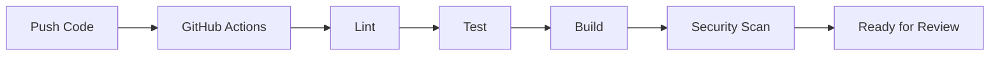

Problems are detected before merging into `main`.

---

## Continuous Delivery

Since `main` is always stable, deployments become routine rather than risky events.

Benefits include:

- Smaller deployments
- Easier rollbacks
- Faster bug fixes
- Lower operational risk

---

## Better Developer Productivity

Developers spend less time:

- resolving merge conflicts
- synchronizing branches
- maintaining release branches

and more time delivering features.

---

# 9. Repository Branch Structure

CommerSync intentionally keeps the branch structure simple.

## Permanent Branch

Only one permanent branch exists.

```
main
```

The `main` branch always represents the latest deployable version of the application.

It is protected and cannot be directly modified.

---

## Temporary Branches

Temporary branches exist only while work is in progress.

Examples:

```
feature/auth-service

feature/order-api

bugfix/cart-refresh

hotfix/payment-timeout

refactor/session-service

docs/api-gateway

test/cache-benchmark

chore/update-eslint
```

Once merged, these branches must be deleted.

---

## Branch Naming Convention

| Type          | Prefix    | Example                  |
| ------------- | --------- | ------------------------ |
| Feature       | feature/  | feature/auth-service     |
| Bug Fix       | bugfix/   | bugfix/cart-refresh      |
| Hotfix        | hotfix/   | hotfix/payment-timeout   |
| Refactor      | refactor/ | refactor/session-service |
| Documentation | docs/     | docs/api-gateway         |
| Test          | test/     | test/load-testing        |
| Chore         | chore/    | chore/update-eslint      |

### Naming Rules

- lowercase only
- use hyphens (`-`) instead of spaces
- use descriptive names
- avoid ticket numbers unless required by team policy

---

## Branch Ownership

The engineer who creates the branch owns it until it is merged or closed.

Ownership includes:

- implementation
- keeping the branch updated
- responding to review comments
- fixing CI failures
- deleting the branch after merge

---

## Branch Lifecycle

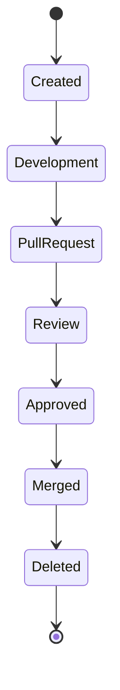

Temporary branches should ideally live for only a few days.

---

# 10. Feature Branch Lifecycle

Every feature follows the same lifecycle.

## Step 1 — Create Branch

Always branch from the latest `main`.

```bash
git checkout main
git pull origin main
git checkout -b feature/auth-service
```

---

## Step 2 — Development

Work should consist of:

- focused commits
- meaningful commit messages
- regular synchronization with `main`

Avoid implementing unrelated changes.

---

## Step 3 — Push Branch

```bash
git push origin feature/auth-service
```

Open a Draft Pull Request early if feedback is desired.

---

## Step 4 — Pull Request

The Pull Request should include:

- purpose
- implementation summary
- testing performed
- screenshots (if applicable)
- linked issue or task

---

## Step 5 — Review

Reviewers verify:

- correctness
- architecture
- testing
- performance
- security
- maintainability

Feedback should be constructive and actionable.

---

## Step 6 — Merge

After approval and passing CI:

```
Feature Branch

↓

Pull Request

↓

Merge

↓

main
```

---

## Step 7 — Delete Branch

Merged feature branches should always be removed.

Deleting the branch:

- reduces repository clutter
- avoids accidental future commits
- keeps active work visible

---

## Complete Lifecycle

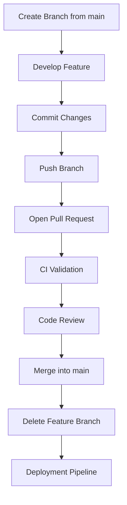

---

## Key Takeaways

- CommerSync follows **Trunk-Based Development**.
- Only `main` is permanent.
- Every change starts from `main`.
- Feature branches are short-lived.
- Merge frequently.
- Delete branches immediately after merging.
- Keep Pull Requests small and focused.
- Continuous integration is central to our workflow.

---

# 11. Pull Request Workflow

A Pull Request (PR) is the primary mechanism for integrating code into the `main` branch. It provides a structured process for reviewing, validating, and discussing changes before they become part of the production codebase.

At CommerSync, **every code change must go through a Pull Request**. Direct commits to `main` are prohibited.

---

## Pull Request Lifecycle

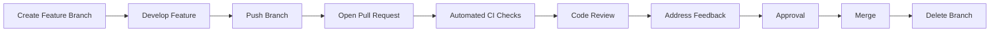

---

## Step 1 — Create a Feature Branch

Always create a feature branch from the latest `main`.

```bash
git checkout main
git pull origin main
git checkout -b feature/order-api
```

Avoid branching from another feature branch unless explicitly approved.

---

## Step 2 — Develop the Feature

During development:

- Keep commits focused.
- Commit frequently.
- Sync with `main` regularly.
- Avoid unrelated changes.

Large, unrelated commits make reviews difficult.

---

## Step 3 — Open a Pull Request Early

Don't wait until development is complete.

Opening a Draft PR early allows:

- early architecture discussions
- design feedback
- visibility into ongoing work
- early CI validation

Draft PRs reduce surprises later.

---

## Step 4 — Automated Validation

Every Pull Request automatically triggers GitHub Actions.

Typical pipeline:

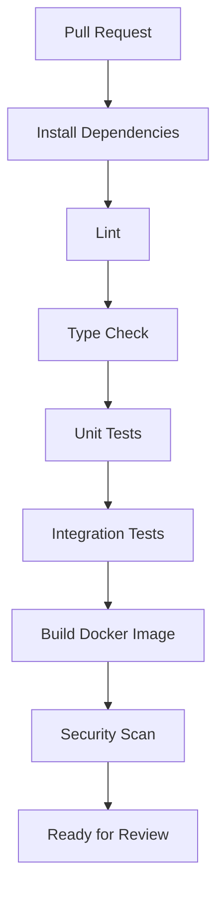

A Pull Request should never be reviewed if automated checks are failing.

---

## Step 5 — Code Review

Review is not simply about finding bugs.

The goal is to improve:

- correctness
- readability
- maintainability
- architecture
- security
- consistency

Healthy reviews are collaborative—not adversarial.

---

## Step 6 — Address Feedback

If changes are requested:

- respond politely
- ask clarifying questions if necessary
- push additional commits
- avoid resolving comments without addressing them

Keep reviewers informed about significant updates.

---

## Step 7 — Approval

A Pull Request may be merged only when:

- all CI checks pass
- required approvals are received
- conversations are resolved
- merge conflicts are resolved

---

## Step 8 — Merge

Once approved:

- Merge into `main`
- Delete the feature branch
- Verify deployment

---

# Pull Request Responsibilities

## Author Responsibilities

The author is responsible for:

- writing clean code
- testing locally
- creating meaningful commits
- writing a descriptive PR
- responding to review comments
- keeping the branch updated
- ensuring CI passes

---

## Reviewer Responsibilities

The reviewer should:

- review promptly
- provide constructive feedback
- explain reasoning
- avoid subjective preferences
- verify architecture
- verify testing
- approve only when confident

Reviews should educate—not discourage.

---

## Pull Request Checklist

Before requesting review, verify:

| Checklist                                   | Status |
| ------------------------------------------- | ------ |
| Code builds successfully                    | ✅     |
| Tests pass                                  | ✅     |
| Lint passes                                 | ✅     |
| No debug code remains                       | ✅     |
| Documentation updated                       | ✅     |
| Feature tested locally                      | ✅     |
| Commit messages follow Conventional Commits | ✅     |

---

# 12. Code Review Standards

Code review protects the long-term health of the repository.

Every review should evaluate more than functionality.

---

## 1. Correctness

Ask:

- Does the feature work?
- Are edge cases handled?
- Is business logic correct?

---

## 2. Architecture

Review whether the implementation aligns with:

- Domain Driven Design
- Clean Architecture
- Repository standards
- Existing patterns

Avoid introducing unnecessary architectural changes.

---

## 3. Security

Review for:

- SQL Injection
- XSS
- Authentication issues
- Authorization
- Sensitive logging
- Secret exposure
- Input validation

Security is everyone's responsibility.

---

## 4. Performance

Consider:

- unnecessary database queries
- N+1 problems
- caching opportunities
- algorithm complexity
- memory usage

Every Pull Request should avoid degrading system performance.

---

## 5. Testing

Verify:

- unit tests
- integration tests
- regression coverage

New functionality should include appropriate tests.

---

## 6. Error Handling

Avoid:

```ts
catch (error) {}
```

Prefer meaningful error handling.

Return actionable messages.

Log useful information.

Never swallow exceptions silently.

---

## 7. Logging

Logs should answer:

- What happened?
- When?
- Why?
- Which request?
- Which user?

Avoid logging:

- passwords
- tokens
- secrets
- payment information

---

## 8. Naming

Names should communicate intent.

Good:

```
calculateCartTotal()

refreshUserSession()

invalidateCache()
```

Bad:

```
calc()

temp()

doStuff()
```

---

## 9. Readability

Good code should explain itself.

Prefer:

- small functions
- descriptive variables
- early returns
- minimal nesting

Readable code reduces future maintenance costs.

---

## 10. Documentation

If behavior changes:

- update documentation
- update API contracts
- update examples if necessary

Code and documentation should evolve together.

---

# 13. Merge Strategy

Git supports multiple merge strategies.

Each has trade-offs.

---

## Merge Commit

```
A---B---C

     \
      D---E

↓

A---B---C------M
     \        /
      D------E
```

### Advantages

- Complete history
- Preserves branch context

### Disadvantages

- Noisy history
- Many merge commits

---

## Rebase Merge

```
main

A---B---C

feature

     D---E

↓

A---B---C---D---E
```

### Advantages

- Linear history
- Easy to read

### Disadvantages

- Rewrites commit history
- Can confuse less experienced developers
- Unsafe after sharing commits

---

## Squash Merge

```
feature

D

E

F

↓

Single Commit

↓

A---B---C---G
```

### Advantages

- Clean history
- One commit per feature
- Easy rollback
- Simple release notes

### Disadvantages

- Individual commit history is lost

---

## Merge Strategy Comparison

| Strategy     | History  | Readability | Recommended       |
| ------------ | -------- | ----------- | ----------------- |
| Merge Commit | Complete | Medium      | ⚠️                |
| Rebase Merge | Linear   | High        | ⚠️ Team Dependent |
| Squash Merge | Clean    | Very High   | ✅ CommerSync     |

---

## CommerSync Standard

CommerSync uses **Squash Merge**.

Why?

- Keeps `main` clean.
- Every PR becomes one logical commit.
- Easier debugging.
- Easier reverting.
- Better release history.

---

# 14. Branch Protection Rules

The `main` branch is the most valuable branch in the repository.

It must be protected from accidental or unsafe changes.

---

## Required Pull Requests

✅ Enabled

Direct pushes are disabled.

Every change must go through review.

---

## Require Approvals

Minimum approvals:

**1**

Critical infrastructure:

**2**

This ensures another engineer validates the implementation.

---

## Require Passing Status Checks

Mandatory checks include:

- Lint
- Type Check
- Unit Tests
- Integration Tests
- Build
- Security Scan

No failing PR should ever be merged.

---

## Require Up-to-Date Branch

Before merging:

Feature branch must contain the latest changes from `main`.

This reduces integration surprises.

---

## Dismiss Stale Reviews

Enabled.

If new commits are pushed after approval, reviewers should re-evaluate the changes.

---

## Require Conversation Resolution

Every review discussion must be resolved before merging.

Open conversations indicate unresolved concerns.

---

## Restrict Direct Pushes

Only automation accounts should have direct push permissions.

Human developers merge through Pull Requests.

---

## Prevent Force Push

Force pushes rewrite history.

History rewriting on `main` is prohibited.

---

## Prevent Branch Deletion

The permanent `main` branch should never be deleted.

GitHub protection prevents accidental removal.

---

## Recommended Branch Protection Matrix

| Rule                      | Enabled                     |
| ------------------------- | --------------------------- |
| Pull Requests Required    | ✅                          |
| Required Approvals        | ✅                          |
| Status Checks             | ✅                          |
| Conversation Resolution   | ✅                          |
| Force Push Disabled       | ✅                          |
| Branch Deletion Disabled  | ✅                          |
| Signed Commits (Optional) | Recommended                 |
| Merge Queue (Optional)    | Recommended for Large Teams |

---

# Key Takeaways

- Every code change enters through a Pull Request.
- CI must pass before review.
- Reviews focus on quality, not just correctness.
- CommerSync uses **Squash Merge**.
- The `main` branch is protected at all times.
- Automation enforces consistency across the engineering organization.

---

# 15. CI/CD Integration

Continuous Integration (CI) and Continuous Delivery (CD) are fundamental to CommerSync's engineering workflow. They ensure that every code change is automatically validated, tested, and prepared for deployment.

The goal is simple:

> **Every merge to `main` should be safe to deploy.**

Git, GitHub Actions, Docker, AWS, and our deployment infrastructure work together to achieve this.

---

## CI/CD Workflow Overview

```mermaid
flowchart LR

A[Developer]
--> B[Feature Branch]

B --> C[Pull Request]

C --> D[GitHub Actions]

D --> E[Lint]

E --> F[Type Check]

F --> G[Unit Tests]

G --> H[Integration Tests]

H --> I[Docker Build]

I --> J[Security Scan]

J --> K[Merge into main]

K --> L[Deploy]

L --> M[AWS]

M --> N[Monitoring]
```

---

## Continuous Integration (CI)

Continuous Integration means integrating small changes into the shared codebase frequently.

Each Pull Request automatically runs validation checks before it can be merged.

Typical checks include:

- Dependency installation
- Linting
- Type checking
- Unit testing
- Integration testing
- Docker image build
- Security scanning

The objective is to identify issues as early as possible.

---

## Continuous Delivery (CD)

Once code is merged into `main`, it becomes eligible for deployment.

The deployment pipeline should be automated and repeatable.

Benefits include:

- Faster releases
- Consistent deployments
- Reduced human error
- Easier rollback
- Higher confidence

Deployment should be a routine engineering activity rather than a stressful event.

---

## Why CI/CD Matters

Without automation:

- Manual deployments become error-prone.
- Bugs reach production more easily.
- Releases become slower.
- Developers lose confidence in deployments.

Automation enables teams to ship frequently while maintaining stability.

---

# 16. Deployment Strategy

One common misconception is that **branches represent environments**.

At CommerSync, this is **not true**.

## Branch ≠ Environment

Some teams use branches like:

```
develop

staging

production
```

CommerSync intentionally avoids this approach.

Instead, environments are deployment targets—not Git branches.

```
main

↓

Deploy

↓

Development

↓

Staging

↓

Production
```

The same codebase can be promoted through multiple environments without creating additional branches.

---

## Environment Flow

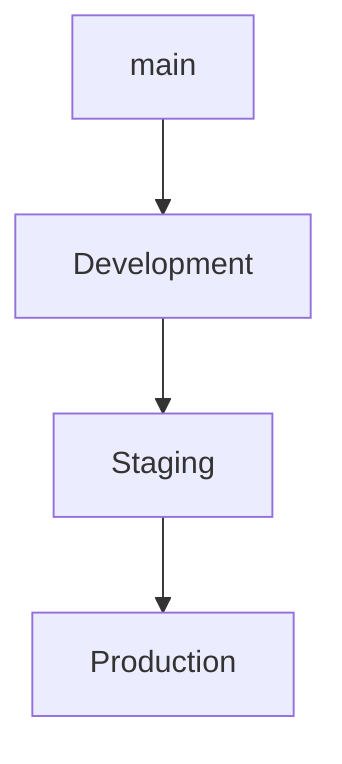

Each environment validates the same artifact under different conditions.

This ensures consistency and reduces environment-specific bugs.

---

## Why We Don't Use Environment Branches

Environment branches often introduce:

- Merge conflicts
- Diverging codebases
- Manual synchronization
- Deployment confusion

Using a single permanent branch simplifies both development and operations.

---

## Deployment Principles

Every deployment should be:

- Automated
- Repeatable
- Observable
- Reversible
- Versioned

Manual production deployments should be the exception—not the norm.

---

# 17. Release Strategy

A deployment is not necessarily a release.

Deployment makes software available.

A release makes functionality available to users.

Separating these concepts allows safer feature rollouts.

---

## Semantic Versioning

CommerSync follows Semantic Versioning:

```
MAJOR.MINOR.PATCH
```

Example:

```
2.4.1
```

Meaning:

| Version | Purpose                          |
| ------- | -------------------------------- |
| MAJOR   | Breaking changes                 |
| MINOR   | New backward-compatible features |
| PATCH   | Backward-compatible bug fixes    |

---

## Release Tags

Each production release should be tagged.

Example:

```
v1.0.0

v1.2.3

v2.0.0
```

Tags provide stable references for:

- Rollbacks
- Release notes
- Auditing
- Debugging

---

## Release Notes

Every release should document:

- New features
- Bug fixes
- Breaking changes
- Database migrations
- Known limitations

Well-written release notes improve communication across engineering and product teams.

---

## GitHub Releases

Git tags should be accompanied by GitHub Releases containing:

- Version number
- Summary
- Changelog
- Upgrade instructions (if applicable)

This creates a searchable history of software evolution.

---

## Feature Flags

Not every feature needs to be released immediately after deployment.

Feature flags allow teams to:

- Deploy incomplete features safely
- Gradually roll out functionality
- Disable problematic features without redeployment

Whenever possible, prefer feature flags over long-lived branches.

---

# 18. Hotfix Strategy

Despite thorough testing, production issues can still occur.

A hotfix is an emergency change intended to restore normal system behavior as quickly and safely as possible.

---

## When to Create a Hotfix

Examples include:

- Payment failures
- Authentication outages
- Security vulnerabilities
- Critical production bugs
- Data corruption risks

Minor UI issues typically do not require a hotfix.

---

## Hotfix Workflow

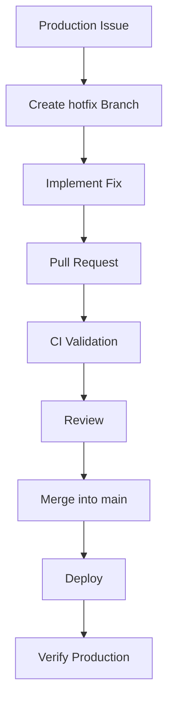

Example branch:

```
hotfix/payment-timeout
```

---

## Hotfix Principles

Hotfixes should:

- Solve one specific problem.
- Avoid unrelated refactoring.
- Be reviewed quickly.
- Be thoroughly tested.
- Be deployed immediately after approval.

The objective is to restore service—not improve architecture.

---

## Incident Response

After a production incident:

1. Restore service.
2. Verify system stability.
3. Perform a root cause analysis.
4. Document lessons learned.
5. Implement preventive measures.

Blameless postmortems help improve systems and processes.

---

# 19. Rollback Strategy

No deployment is risk-free.

A rollback strategy ensures the team can recover quickly if something goes wrong.

---

## Preferred Approach

Whenever possible:

**Rollback the deployment—not Git history.**

Deployment rollback is generally safer and faster than rewriting repository history.

---

## Git Revert

If an incorrect change has been merged:

```
Bad Commit

↓

git revert

↓

New Commit

↓

History Preserved
```

Using `git revert` creates a new commit that safely undoes previous changes.

This preserves repository history and avoids disrupting collaborators.

---

## Avoid Force Push

Never use:

```bash
git push --force
```

on the `main` branch.

Force pushes rewrite history and can disrupt other developers' work.

---

## Deployment Rollback

A deployment rollback restores the previously known stable version of the application.

Typical workflow:

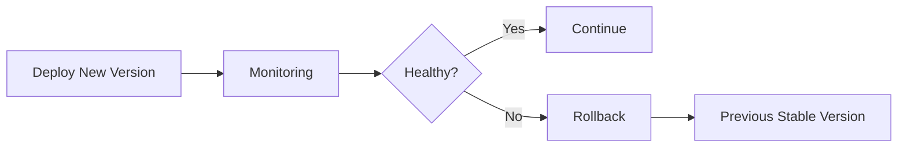

Automated deployment tools should support rapid rollback.

---

## Database Rollback Considerations

Application rollbacks are usually straightforward.

Database rollbacks are often more complex.

Best practices:

- Prefer additive schema changes.
- Avoid destructive migrations.
- Make migrations backward-compatible.
- Test rollback procedures before production.

Schema design should always consider recovery scenarios.

---

## Post-Rollback Verification

After any rollback:

- Verify application health.
- Confirm database integrity.
- Monitor logs and metrics.
- Validate critical user journeys.
- Inform stakeholders.

A successful rollback is only complete after the system is confirmed stable.

---

# Key Takeaways

- CI validates every Pull Request automatically.
- CD enables safe, repeatable deployments.
- Branches do not represent environments.
- Only `main` is deployed through the pipeline.
- Releases should follow Semantic Versioning.
- Feature flags are preferred over long-running branches.
- Hotfixes focus on restoring service quickly.
- Use `git revert` instead of rewriting Git history.
- Every deployment should have a tested rollback plan.

---

# 20. Conventional Commits

Commit messages are part of the project's documentation. A well-written commit history makes it easier to understand changes, generate release notes, and troubleshoot issues.

CommerSync follows the **Conventional Commits** specification.

## Commit Format

```
<type>(optional-scope): <description>
```

Example:

```text
feat(auth): implement refresh token rotation
```

---

## Common Commit Types

| Type     | Purpose                                  | Example                                   |
| -------- | ---------------------------------------- | ----------------------------------------- |
| feat     | New feature                              | `feat(order): add order cancellation API` |
| fix      | Bug fix                                  | `fix(cart): prevent duplicate items`      |
| docs     | Documentation                            | `docs(auth): update API guide`            |
| refactor | Code improvement without behavior change | `refactor(cache): simplify Redis client`  |
| test     | Tests                                    | `test(user): add login integration tests` |
| chore    | Maintenance                              | `chore: upgrade dependencies`             |
| ci       | CI/CD changes                            | `ci: optimize GitHub Actions cache`       |
| perf     | Performance improvements                 | `perf(search): reduce database queries`   |
| build    | Build configuration                      | `build: update Docker image`              |

---

## Commit Message Guidelines

A good commit message should:

- Describe **what** changed.
- Be concise.
- Use the imperative mood.
- Represent a single logical change.

✅ Good

```text
feat(payment): add Razorpay webhook validation
```

❌ Bad

```text
Fixed stuff

Update

Changes

Work in progress
```

---

# 21. Branch Naming Standards

Branch names should clearly communicate the purpose of the work.

## Naming Format

```
<type>/<short-description>
```

Examples:

```text
feature/auth-service

feature/order-api

bugfix/cart-refresh

hotfix/payment-timeout

refactor/session-service

docs/api-gateway

chore/update-eslint
```

---

## Naming Rules

- Use lowercase letters.
- Separate words with hyphens (`-`).
- Keep names short but descriptive.
- Avoid personal names.
- Avoid generic names such as `test`, `new`, or `temp`.

---

## Good vs Bad Examples

| Good                   | Bad               |
| ---------------------- | ----------------- |
| feature/user-profile   | feature1          |
| bugfix/cart-refresh    | bug               |
| hotfix/payment-timeout | fix               |
| docs/api-gateway       | docs-update-final |

---

# 22. Best Practices

Following these practices helps maintain a healthy repository and improves team productivity.

| #   | Best Practice                                    |
| --- | ------------------------------------------------ |
| 1   | Pull the latest `main` before creating a branch. |
| 2   | Keep feature branches short-lived.               |
| 3   | Open Pull Requests early.                        |
| 4   | Prefer many small PRs over one large PR.         |
| 5   | Write meaningful commit messages.                |
| 6   | Test locally before pushing.                     |
| 7   | Let CI complete before requesting review.        |
| 8   | Keep PR descriptions clear and complete.         |
| 9   | Review code respectfully and constructively.     |
| 10  | Respond to review comments promptly.             |
| 11  | Delete merged branches immediately.              |
| 12  | Rebase or update your branch frequently.         |
| 13  | Never commit secrets or credentials.             |
| 14  | Avoid unrelated changes in the same PR.          |
| 15  | Write tests for new functionality.               |
| 16  | Update documentation when behavior changes.      |
| 17  | Prefer feature flags over long-lived branches.   |
| 18  | Keep functions small and readable.               |
| 19  | Use descriptive variable and function names.     |
| 20  | Leave the codebase cleaner than you found it.    |

> **Engineering Principle:** Small, frequent, and well-tested changes are easier to review, deploy, and maintain than large, infrequent changes.

---

# 23. Anti-Patterns

The following practices should be avoided.

| Anti-Pattern                                | Why It's Harmful                      |
| ------------------------------------------- | ------------------------------------- |
| Direct commits to `main`                    | Bypasses review and CI.               |
| Large Pull Requests                         | Difficult to review and test.         |
| Long-lived branches                         | Increase merge conflicts.             |
| Force pushing to `main`                     | Rewrites repository history.          |
| Ignoring CI failures                        | Introduces unstable code.             |
| Mixing multiple features in one PR          | Complicates reviews and rollbacks.    |
| Generic commit messages                     | Make history difficult to understand. |
| Skipping tests                              | Increases regression risk.            |
| Leaving branches after merge                | Creates repository clutter.           |
| Merging without review                      | Reduces code quality.                 |
| Committing generated files unnecessarily    | Creates noisy diffs.                  |
| Keeping secrets in Git                      | Major security risk.                  |
| Resolving review comments without changes   | Breaks trust in the review process.   |
| Making unrelated refactors in feature PRs   | Increases review complexity.          |
| Using `git push --force` on shared branches | Can overwrite teammates' work.        |

---

# 24. Frequently Asked Questions (FAQ)

## Why do we only have one permanent branch?

A single permanent branch simplifies development, reduces merge conflicts, and supports continuous delivery.

---

## Why can't I push directly to `main`?

Every change must be reviewed and validated through CI before becoming part of the production codebase.

---

## Why are small Pull Requests preferred?

Smaller PRs are easier to review, test, and merge, reducing the likelihood of defects.

---

## Should I rebase or merge `main` into my branch?

Either approach is acceptable if it keeps your branch up to date. Follow the team's preferred workflow and avoid rewriting shared history.

---

## Can I keep a feature branch open for several weeks?

No. Long-lived branches increase merge conflicts and reduce integration frequency. Split large features into smaller PRs whenever possible.

---

## What happens if my Pull Request fails CI?

Investigate and resolve the failures before requesting or continuing code review.

---

## When should I create a hotfix branch?

Only for urgent production issues that require immediate attention.

---

## Should every commit be perfect?

No. Intermediate commits are acceptable during development. The final merged history is kept clean through Squash Merge.

---

# 25. Common Scenarios

## Scenario 1 — I Merged the Wrong Pull Request

1. Identify the merge commit.
2. Create a revert PR using `git revert`.
3. Review and merge the revert.
4. Deploy the corrected version.

---

## Scenario 2 — My Pull Request Has Merge Conflicts

1. Update your branch from the latest `main`.
2. Resolve conflicts locally.
3. Test the application.
4. Push the updated branch.

---

## Scenario 3 — I Accidentally Deleted My Branch

If the branch was already merged, no action is required.

If not, recover it using Git's reflog or the commit SHA if available.

---

## Scenario 4 — Production Deployment Failed

1. Stop further deployments.
2. Review deployment logs.
3. Roll back to the previous stable release if necessary.
4. Investigate the root cause.
5. Create a follow-up fix.

---

## Scenario 5 — My Feature Is Too Large

Break it into multiple smaller Pull Requests.

Whenever possible:

- PR 1: Infrastructure
- PR 2: Backend logic
- PR 3: API integration
- PR 4: UI implementation

Incremental delivery reduces review complexity.

---

# 26. Troubleshooting Guide

## Detached HEAD

**Problem**

You are not on a branch.

**Solution**

```bash
git switch <branch-name>
```

---

## Push Rejected

**Problem**

Your local branch is behind the remote branch.

**Solution**

```bash
git pull --rebase
```

Resolve conflicts if required, then push again.

---

## Merge Conflicts

**Problem**

Git cannot automatically merge changes.

**Solution**

- Resolve conflicting files.
- Test the application.
- Commit the resolved changes.

---

## Accidentally Committed the Wrong File

Use:

```bash
git restore --staged <file>
```

or amend the commit before pushing.

---

## Deleted the Wrong Commit

If recoverable:

```bash
git reflog
```

Locate the commit and restore it.

---

# 27. Appendix

## Useful Git Commands

| Purpose              | Command                             |
| -------------------- | ----------------------------------- |
| Clone repository     | `git clone`                         |
| Create branch        | `git checkout -b <branch>`          |
| Switch branch        | `git switch <branch>`               |
| Check status         | `git status`                        |
| View history         | `git log --oneline --graph`         |
| Stage changes        | `git add .`                         |
| Commit changes       | `git commit -m ""`                  |
| Push branch          | `git push origin <branch>`          |
| Pull latest changes  | `git pull origin main`              |
| Revert commit        | `git revert <sha>`                  |
| Delete local branch  | `git branch -d <branch>`            |
| Delete remote branch | `git push origin --delete <branch>` |

---

## Recommended Git Aliases

```bash
git config --global alias.st status

git config --global alias.co checkout

git config --global alias.br branch

git config --global alias.cm commit

git config --global alias.lg "log --oneline --graph --decorate"
```

These aliases reduce typing and improve developer productivity.

---

## Glossary

| Term         | Definition                                                          |
| ------------ | ------------------------------------------------------------------- |
| Branch       | A lightweight pointer to a commit.                                  |
| Commit       | A snapshot of the repository at a point in time.                    |
| Pull Request | A request to merge changes into another branch.                     |
| CI           | Continuous Integration.                                             |
| CD           | Continuous Delivery/Deployment.                                     |
| Merge        | Combining two branches.                                             |
| Rebase       | Reapplying commits onto another base commit.                        |
| HEAD         | The currently checked-out commit or branch.                         |
| Tag          | A named reference to a specific commit, commonly used for releases. |
| Squash Merge | Combines all commits from a PR into a single commit.                |

---

# Summary

The CommerSync branching strategy is built on a few core principles:

- **One permanent branch (`main`)**
- **Short-lived feature branches**
- **Mandatory Pull Requests**
- **Automated CI/CD validation**
- **Squash Merge workflow**
- **Protected `main` branch**
- **Semantic Versioning**
- **Safe rollback practices**
- **Consistent branch naming**
- **Conventional Commits**

Following these standards ensures that the repository remains maintainable, scalable, and reliable as the engineering organization grows.

> **Remember:** A good branching strategy is not about Git commands—it's about enabling teams to collaborate safely, ship software confidently, and maintain a codebase that can evolve for years to come.
