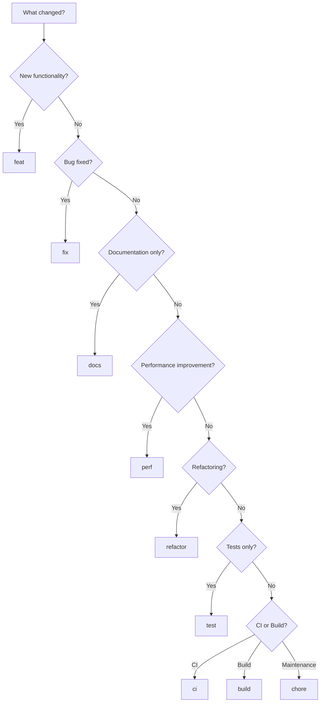
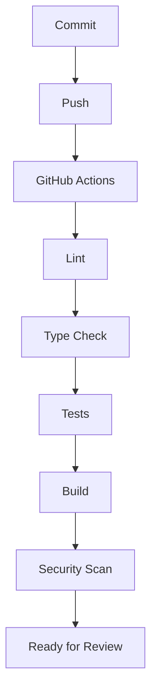
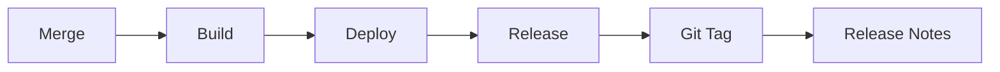
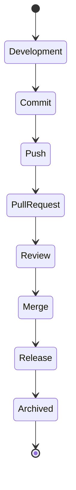
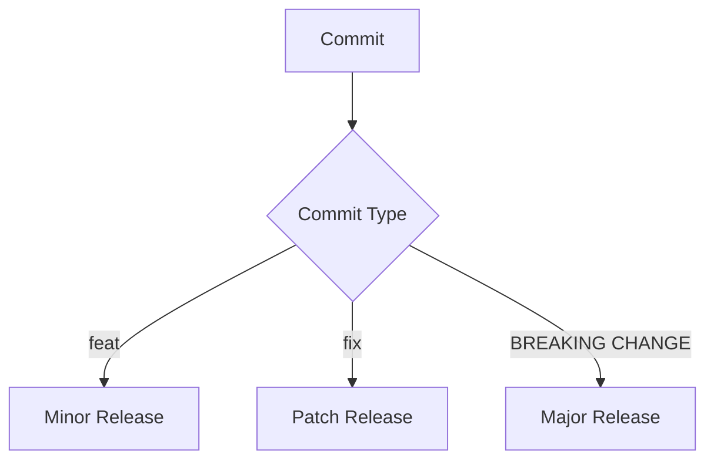

# Commit Convention

> **Document Status:** Approved  
> **Project:** CommerSync  
> **Version:** 1.0.0  
> **Audience:** All Contributors, Engineers, Tech Leads, Staff Engineers  
> **Applies To:** Entire Repository

---

# Table of Contents

1. Purpose
2. Why Commit Messages Matter
3. Conventional Commits Overview
4. Commit Message Anatomy

---

# 1. Purpose

A commit is more than a snapshot of code—it is a permanent record of **why** a change was made. As CommerSync grows into an enterprise-scale platform with multiple services, teams, and contributors, maintaining a consistent commit history becomes essential.

This handbook defines the official commit message standard for the CommerSync repository. It establishes a common language that enables engineers to communicate changes clearly, automate release processes, and maintain a high-quality project history.

Every contributor is expected to follow these conventions regardless of the size or complexity of their changes.

---

## Objectives

This handbook aims to:

- Standardize commit messages across the repository.
- Improve readability of Git history.
- Enable automated tooling and release workflows.
- Simplify code reviews and debugging.
- Support Semantic Versioning and changelog generation.
- Make project history understandable for future contributors.

A well-written commit history becomes an invaluable engineering asset over the lifetime of the project.

---

## Engineering Principles

CommerSync follows several core principles regarding commits.

### Commits Should Tell a Story

A project's Git history should explain how the software evolved.

Instead of reading source code alone, an engineer should be able to understand:

- what changed
- why it changed
- when it changed
- who changed it

through commit history.

---

### Every Commit Should Have One Responsibility

A commit should represent a single logical unit of work.

Good examples:

- Add refresh token validation
- Fix Redis cache expiration
- Update Docker build pipeline

Poor example:

- Authentication changes, Docker updates, documentation fixes, and dependency upgrades in one commit

Single-purpose commits make reviews, rollbacks, and debugging significantly easier.

---

### Commit History Is Documentation

Unlike comments that may become outdated, commit history permanently records engineering decisions.

Future engineers frequently rely on commit history to answer questions such as:

- Why was this validation added?
- When did this API change?
- Why was Redis introduced here?
- Why was this service refactored?

A meaningful commit message often provides the answer without requiring additional investigation.

---

# 2. Why Commit Messages Matter

Writing meaningful commit messages is not simply a matter of style—it directly impacts collaboration, maintainability, and engineering productivity.

---

## Better Code Reviews

Pull Requests consist of one or more commits.

Well-written commits help reviewers understand:

- the purpose of each change
- the sequence of implementation
- design decisions
- intended behavior

Compare the following examples.

### Poor History

```text
update

fix

changes

more fixes

final
```

A reviewer gains almost no context from these messages.

---

### Meaningful History

```text
feat(auth): implement refresh token rotation

fix(auth): prevent expired refresh token reuse

test(auth): add integration tests for token refresh

docs(auth): document authentication flow
```

The purpose of each commit is immediately clear.

---

## Easier Debugging

When investigating production issues, engineers often use Git history to identify when a regression was introduced.

Commands such as:

```bash
git log

git blame

git bisect
```

become significantly more useful when commit messages clearly describe the change.

---

## Improved Collaboration

Large engineering teams depend on clear communication.

A descriptive commit message enables teammates to understand changes without opening every modified file.

This is especially important in a monorepo where engineers may not be familiar with every service or package.

---

## Simplified Rollbacks

Suppose a production issue is traced to a recent change.

Compare these histories.

### Poor

```text
Update

Changes

Bug Fix

Final
```

Finding the problematic commit becomes difficult.

---

### Good

```text
feat(payment): add payment retry mechanism

fix(order): prevent duplicate order creation

refactor(redis): simplify cache abstraction
```

The affected area can be identified almost immediately.

---

## Better Release Notes

Structured commit messages enable automated release documentation.

Example:

```text
Features

• Authentication
• Cart improvements

Bug Fixes

• Payment timeout handling

Documentation

• API Gateway guide
```

Without structured commits, release notes often require manual editing.

---

## Long-Term Maintainability

A project like CommerSync will evolve over many years.

Future contributors should be able to answer questions such as:

- When was this service introduced?
- Why was this database migration required?
- When did the authentication model change?

Commit history provides this context.

---

## Summary

Good commit messages improve:

| Area          | Benefit                         |
| ------------- | ------------------------------- |
| Code Reviews  | Easier understanding of changes |
| Debugging     | Faster issue identification     |
| Collaboration | Better communication            |
| Releases      | Automated release notes         |
| Rollbacks     | Safer recovery                  |
| Maintenance   | Clear project history           |

---

# 3. Conventional Commits Overview

To ensure consistency across the repository, CommerSync adopts the **Conventional Commits 1.0.0** specification.

Conventional Commits define a simple, standardized format for commit messages that can be understood by both humans and automated tools.

The official specification is maintained by the Conventional Commits project and serves as the foundation for many modern engineering workflows.

---

## Why Use Conventional Commits?

Structured commit messages provide several advantages:

- Consistent commit history
- Easier code reviews
- Automatic changelog generation
- Semantic Versioning support
- Release automation
- Better searchability

Instead of interpreting free-form commit messages, tools can reliably determine the intent of each change.

---

## Conventional Commits in CommerSync

CommerSync extends the standard specification by introducing repository-specific scopes for domains such as:

- Authentication
- Orders
- Payments
- Inventory
- Redis
- Docker
- CI/CD
- Infrastructure

This ensures commit messages remain both standardized and meaningful within the project's architecture.

---

## Engineering Philosophy

Conventional Commits are not intended to restrict developers—they provide a shared language.

Every engineer should be able to glance at a commit message and immediately understand:

- what changed
- where it changed
- the type of change

without opening the code.

---

## Example

Instead of:

```text
updated api
```

Prefer:

```text
feat(order): add order cancellation endpoint
```

The second example immediately communicates:

- Type → Feature
- Scope → Order Service
- Description → Order cancellation endpoint

---

# 4. Commit Message Anatomy

Every commit message follows the same general structure.

```text
<type>(<scope>): <description>
```

Additional sections such as the body and footer may be included when appropriate.

---

## Overall Structure

```text
<type>(<scope>): <description>

<body>

<footer>
```

Example:

```text
feat(auth): implement refresh token rotation

Introduce rotating refresh tokens to improve session security.
Existing refresh tokens are invalidated after successful use.

BREAKING CHANGE: Refresh token format has changed.
```

---

## Type

The **type** describes the category of change.

Examples:

```text
feat

fix

docs

refactor

test

ci

perf
```

The type should clearly indicate the intent of the commit.

Examples:

```text
feat(cart): support guest checkout

fix(payment): handle gateway timeout

docs(repo): update contribution guide
```

---

## Scope

The scope identifies the area of the project affected by the change.

Examples:

```text
auth

cart

order

payment

search

redis

docker

gateway
```

Scopes are optional but strongly recommended.

They make it significantly easier to understand which domain was modified.

Example:

```text
fix(cart): prevent duplicate cart items
```

Without the scope:

```text
fix: prevent duplicate cart items
```

The affected service is less obvious.

---

## Description

The description should briefly summarize the change.

Guidelines:

- Use imperative mood.
- Start with a lowercase letter.
- Do not end with a period.
- Keep it concise.
- Describe what the commit does.

Good examples:

```text
feat(auth): implement email verification

fix(search): prevent duplicate indexing

docs(repo): add onboarding guide
```

Poor examples:

```text
Fixed Bug

Updated Stuff

Changes

Misc

Final Fix
```

---

## Body (Optional)

A commit body provides additional context that cannot fit into the summary.

Use the body to explain:

- why the change was needed
- implementation decisions
- design trade-offs
- migration notes

Example:

```text
refactor(order): simplify order validation

Validation rules have been extracted into dedicated validators
to reduce duplication between the Order and Checkout services.
```

---

## Footer (Optional)

Footers contain structured metadata.

Examples include:

```text
BREAKING CHANGE:

Fixes #128

Refs #341

Co-authored-by:

Signed-off-by:
```

These are especially useful for automation and issue tracking.

The footer format will be covered in detail later in this handbook.

---

## Anatomy Summary

| Component   | Required    | Purpose                                  |
| ----------- | ----------- | ---------------------------------------- |
| Type        | ✅          | Categorizes the change                   |
| Scope       | Recommended | Identifies the affected domain           |
| Description | ✅          | Summarizes the change                    |
| Body        | Optional    | Explains why the change was made         |
| Footer      | Optional    | Adds metadata and automation information |

---

## Key Takeaways

- Every commit should communicate intent clearly.
- Commit messages are permanent engineering documentation.
- Conventional Commits provide a consistent structure for humans and tools.
- Types categorize changes, while scopes identify affected domains.
- Descriptions should be concise, imperative, and meaningful.
- Bodies and footers provide additional context when necessary.

---

# 5. Official Commit Types

Commit **types** are the foundation of the Conventional Commits specification. They describe the primary intent of a change and enable both engineers and automation tools to understand what a commit represents.

Choosing the correct type improves:

- Git history readability
- Code review efficiency
- Changelog generation
- Semantic Versioning
- Release automation

A commit should have **one primary intent**. If a change could fit multiple types, choose the type that best represents the main purpose of the commit.

---

## Commit Types Overview

| Type       | Purpose                                           | Version Impact             |
| ---------- | ------------------------------------------------- | -------------------------- |
| `feat`     | Introduces new functionality                      | MINOR                      |
| `fix`      | Fixes incorrect behavior                          | PATCH                      |
| `docs`     | Documentation only                                | None                       |
| `style`    | Formatting or stylistic changes                   | None                       |
| `refactor` | Improves code structure without changing behavior | None                       |
| `perf`     | Improves performance                              | PATCH (typically)          |
| `test`     | Adds or updates tests                             | None                       |
| `build`    | Changes build system or dependencies              | None                       |
| `ci`       | Changes CI/CD configuration                       | None                       |
| `chore`    | Repository maintenance                            | None                       |
| `revert`   | Reverts a previous commit                         | Depends on reverted change |

---

## `feat` — New Feature

### Purpose

Use `feat` when introducing **new functionality** that did not previously exist.

Examples include:

- New API endpoints
- New business logic
- New user-facing functionality
- New infrastructure capabilities

---

### When to Use

Use `feat` when:

- Adding checkout support
- Introducing authentication
- Creating a notification service
- Adding Redis caching
- Implementing search filters

---

### When NOT to Use

Do **not** use `feat` for:

- Bug fixes
- Refactoring existing code
- Documentation updates
- Dependency upgrades

---

### CommerSync Examples

```text
feat(auth): implement refresh token rotation

feat(product): add bulk product import API

feat(cart): support guest shopping carts

feat(payment): integrate Razorpay payment gateway

feat(search): add fuzzy product search
```

---

## `fix` — Bug Fix

### Purpose

Use `fix` when correcting incorrect or unexpected behavior.

A bug fix should restore the intended behavior without introducing unrelated functionality.

---

### When to Use

Examples:

- Resolve API errors
- Correct validation logic
- Fix race conditions
- Handle edge cases
- Resolve production defects

---

### When NOT to Use

Avoid `fix` when:

- Adding entirely new features
- Improving code readability
- Updating documentation

---

### CommerSync Examples

```text
fix(cart): prevent duplicate cart items

fix(order): handle concurrent order creation

fix(auth): reject expired refresh tokens

fix(search): escape special search characters

fix(payment): retry failed webhook verification
```

---

## `docs` — Documentation

### Purpose

Use `docs` when modifying documentation only.

Documentation changes should not affect runtime behavior.

---

### Examples

```text
docs(repo): add contribution guide

docs(auth): document OAuth login flow

docs(api): update order API examples

docs(docker): explain local development setup
```

---

### When NOT to Use

Do not use `docs` if code behavior changes alongside documentation.

In that case, use the type that best represents the code change.

---

## `style` — Formatting

### Purpose

Use `style` for changes that affect formatting but **not functionality**.

Examples include:

- indentation
- whitespace
- line wrapping
- import ordering (if purely stylistic)

---

### Examples

```text
style(repo): format workspace configuration

style(auth): align middleware formatting

style(product): organize imports
```

---

### When NOT to Use

Do not use `style` for:

- code cleanup
- refactoring
- logic changes

Those belong under `refactor`.

---

## `refactor` — Code Improvement

### Purpose

Use `refactor` when changing internal implementation without changing external behavior.

The application should behave exactly the same before and after the change.

---

### Examples

```text
refactor(order): extract validation service

refactor(redis): simplify cache abstraction

refactor(notification): reduce duplicate event handlers

refactor(payment): isolate gateway adapters
```

---

### When NOT to Use

Do not use `refactor` if:

- functionality changes
- bugs are fixed
- performance is significantly improved

---

## `perf` — Performance Improvements

### Purpose

Use `perf` when improving performance without introducing new functionality.

---

### Examples

```text
perf(search): optimize Elasticsearch queries

perf(cart): reduce database lookups

perf(redis): minimize cache serialization

perf(product): batch inventory updates
```

---

### When NOT to Use

Avoid `perf` for general code cleanup unless measurable performance improvements are the primary objective.

---

## `test` — Tests

### Purpose

Use `test` when adding or updating automated tests.

---

### Examples

```text
test(auth): add login integration tests

test(order): cover payment failure scenarios

test(cart): increase checkout coverage

test(search): add search API contract tests
```

---

### When NOT to Use

Do not use `test` if production code is also modified.

Instead, choose the primary purpose of the commit.

---

## `build` — Build System

### Purpose

Use `build` for changes affecting the build process or dependencies.

---

### Examples

```text
build(repo): upgrade TypeScript to latest version

build(docker): optimize production image layers

build(node): update Node.js runtime version

build(api): migrate to new build pipeline
```

---

## `ci` — Continuous Integration

### Purpose

Use `ci` for changes to automation pipelines.

---

### Examples

```text
ci(github): add dependency cache

ci(github): enable security scanning

ci(actions): parallelize integration tests

ci(repo): enforce commit message validation
```

---

### Typical Changes

- GitHub Actions
- Jenkins
- CircleCI
- Build pipelines
- Deployment workflows

---

## `chore` — Repository Maintenance

### Purpose

Use `chore` for maintenance tasks that do not affect application behavior.

---

### Examples

```text
chore(repo): update editorconfig

chore(config): reorganize environment variables

chore(deps): remove unused packages

chore(github): update issue templates
```

---

### When NOT to Use

Avoid using `chore` as a catch-all category.

If a more specific type exists, prefer it.

---

## `revert` — Revert Changes

### Purpose

Use `revert` when undoing a previous commit.

---

### Examples

```text
revert(payment): revert payment retry implementation

revert(order): revert optimistic locking changes

revert(search): revert search ranking algorithm
```

---

## Type Selection Decision Guide



---

# 6. CommerSync Scope Definitions

While the **type** describes _what_ changed, the **scope** identifies _where_ the change occurred.

Scopes provide additional context, making Git history easier to search, review, and understand.

Although scopes are optional in the Conventional Commits specification, they are **strongly recommended** in CommerSync.

---

## Scope Naming Rules

- Use lowercase only.
- Use singular nouns where appropriate.
- Keep names concise.
- Match architectural boundaries.
- Avoid creating new scopes unless necessary.

---

## Official Scope Definitions

| Scope          | Description                                   |
| -------------- | --------------------------------------------- |
| `repo`         | Repository-wide configuration and tooling     |
| `docs`         | Documentation and engineering guides          |
| `infra`        | Infrastructure provisioning and deployment    |
| `auth`         | Authentication and authorization services     |
| `user`         | User management and profiles                  |
| `product`      | Product catalog and product APIs              |
| `category`     | Product category management                   |
| `inventory`    | Inventory tracking and stock management       |
| `cart`         | Shopping cart functionality                   |
| `checkout`     | Checkout flow and validation                  |
| `payment`      | Payment processing and gateway integration    |
| `order`        | Order creation and lifecycle                  |
| `shipping`     | Shipping methods and fulfillment              |
| `pricing`      | Pricing engine and calculations               |
| `promotion`    | Coupons, discounts, and promotional campaigns |
| `wishlist`     | Wishlist functionality                        |
| `review`       | Product ratings and customer reviews          |
| `search`       | Search indexing and search APIs               |
| `notification` | Email, SMS, and push notifications            |
| `analytics`    | Metrics, reporting, and business analytics    |
| `admin`        | Administrative dashboard and tools            |
| `gateway`      | API Gateway and routing                       |
| `database`     | Database schema and migrations                |
| `redis`        | Redis caching and session storage             |
| `docker`       | Dockerfiles and containerization              |
| `aws`          | AWS infrastructure and cloud services         |
| `ci`           | Continuous Integration configuration          |
| `github`       | GitHub workflows and repository settings      |
| `config`       | Shared configuration files                    |
| `security`     | Security enhancements and policies            |
| `worker`       | Background workers and scheduled jobs         |
| `queue`        | Queue processing and message brokers          |
| `event`        | Event publishing and consumers                |

---

## Scope Examples

### Authentication

```text
feat(auth): support passwordless login

fix(auth): reject reused refresh tokens

test(auth): add session expiration tests
```

---

### Product Service

```text
feat(product): add product archive endpoint

fix(product): prevent duplicate SKUs

refactor(product): simplify repository layer
```

---

### Cart

```text
feat(cart): persist guest cart

fix(cart): calculate taxes correctly

perf(cart): batch product lookups
```

---

### Orders

```text
feat(order): support partial order cancellation

fix(order): prevent duplicate order IDs

refactor(order): separate validation pipeline
```

---

### Payments

```text
feat(payment): integrate Stripe webhooks

fix(payment): handle webhook retries

security(payment): validate request signatures
```

> **Note:** While `security` appears as a scope in the last example, the commit type should still accurately represent the primary intent. For instance, `fix(security):` or `feat(security):` would be appropriate depending on the change.

---

### Infrastructure

```text
build(docker): reduce production image size

ci(github): cache pnpm dependencies

chore(repo): update workspace configuration

docs(infra): document deployment architecture
```

---

## Choosing the Correct Scope

When multiple scopes could apply, choose the **primary area of impact**.

Example:

A change that updates authentication middleware and modifies the API Gateway.

Preferred:

```text
feat(auth): add API key validation
```

Not:

```text
feat(auth-gateway-api-security): add validation
```

Keep scopes concise and meaningful.

---

## Key Takeaways

- Commit **types** describe **what** changed.
- Commit **scopes** describe **where** the change occurred.
- Choose the most specific type available.
- Use scopes consistently across the repository.
- Avoid generic scopes such as `misc`, `temp`, or `update`.
- A consistent commit history improves searchability, release automation, and engineering collaboration.

---

# 7. Commit Description Guidelines

A commit message should communicate its purpose in a way that is clear, concise, and immediately understandable. While the **type** and **scope** categorize the change, the **description** explains exactly what was done.

The description is the most frequently read part of a commit message and should therefore be written with care.

---

## General Format

```text
<type>(<scope>): <description>
```

Example:

```text
feat(order): add support for partial order cancellation
```

A reader should understand the purpose of the change without opening the commit.

---

## Use the Imperative Mood

Write commit descriptions as **commands**, not statements.

Think of the message as completing the sentence:

> "If applied, this commit will..."

For example:

> If applied, this commit will **add support for guest checkout**.

### ✅ Good

```text
feat(cart): support guest checkout

fix(auth): validate refresh token expiration

docs(repo): update onboarding guide

refactor(order): simplify order validation
```

### ❌ Bad

```text
feat(cart): added guest checkout

fix(auth): fixed token bug

docs(repo): updated documentation

refactor(order): simplifying validation
```

The imperative mood is concise, consistent, and widely adopted across major open-source projects.

---

## Use Present Tense

Commit messages should describe **what the commit does**, not what it did.

### ✅ Good

```text
fix(payment): retry failed webhook verification
```

### ❌ Bad

```text
fix(payment): retried webhook verification

fix(payment): retries webhook verification

fix(payment): retrying webhook verification
```

---

## Start with a Lowercase Letter

Descriptions should begin with lowercase unless the first word is a proper noun or acronym.

### ✅ Good

```text
feat(search): improve search relevance

docs(api): add OpenAPI examples

ci(github): cache pnpm dependencies
```

### ❌ Bad

```text
feat(search): Improve search relevance

docs(api): Add examples
```

This creates a consistent visual style across Git history.

---

## Do Not End with a Period

Commit descriptions are summaries, not complete paragraphs.

### ✅ Good

```text
fix(cart): prevent duplicate cart items
```

### ❌ Bad

```text
fix(cart): prevent duplicate cart items.
```

---

## Keep Descriptions Concise

Aim for a short description that captures the primary purpose of the commit.

As a guideline:

- Prefer fewer than 72 characters.
- Remove unnecessary words.
- Focus on the outcome.

### Better

```text
feat(order): support order cancellation
```

Instead of:

```text
feat(order): implement functionality to allow users to cancel their existing orders
```

Additional details belong in the commit body.

---

## Describe What, Not How

The description should summarize **the result**, not the implementation.

### ✅ Good

```text
perf(search): reduce product search latency
```

### Less Helpful

```text
perf(search): replace nested loop with hash map
```

Implementation details can be explained in the body if necessary.

---

## One Responsibility per Commit

Each commit should represent one logical change.

### Good

```text
feat(cart): support guest carts

test(cart): add guest cart integration tests

docs(cart): document guest cart behavior
```

### Poor

```text
feat(cart): support guest carts and update Docker configuration and fix Redis bug
```

Small, focused commits improve reviews, simplify rollbacks, and make Git history easier to navigate.

---

## Description Checklist

Before committing, ask:

- Does the description explain the primary change?
- Is it written in the imperative mood?
- Is it concise?
- Is it lowercase?
- Does it avoid unnecessary punctuation?
- Would another engineer understand it immediately?

If the answer to any question is "no," revise the message.

---

# 8. Commit Body

Most commits only require a summary line. However, some changes benefit from additional context.

The commit body provides that context.

---

## When to Include a Commit Body

A body should be added when the summary alone cannot fully explain the change.

Common situations include:

- Architectural decisions
- Complex implementations
- Design trade-offs
- Performance improvements
- Security changes
- Database migrations
- Breaking behavior
- Infrastructure updates

---

## Purpose of the Commit Body

A good body answers questions such as:

- Why was this change needed?
- What problem does it solve?
- Were any trade-offs considered?
- Are there migration considerations?
- Does it affect existing behavior?

It should **not** simply repeat the summary.

---

## Example — Simple Commit

```text
fix(cart): prevent duplicate cart items
```

No additional explanation is necessary.

---

## Example — Complex Commit

```text
refactor(order): simplify order validation

Extract validation rules into dedicated validator classes.

This removes duplicated validation logic between the
Checkout Service and Order Service while making future
validation rules easier to extend.
```

The summary explains **what** changed.

The body explains **why**.

---

## Example — Performance Improvement

```text
perf(search): optimize product search queries

Replace multiple sequential database queries with a single
aggregated query.

Average response time improved from 180ms to 65ms during
performance benchmarking.
```

Including measurable improvements provides useful historical context.

---

## Example — Database Migration

```text
feat(database): introduce order status history table

The existing schema stored only the latest status.

The new table records every status transition to support
order tracking and audit requirements.
```

Future engineers will immediately understand the motivation.

---

## Writing Guidelines

A commit body should:

- Explain the reason for the change.
- Focus on business or architectural context.
- Be wrapped at a reasonable line length.
- Avoid excessive implementation details.

Prefer concise paragraphs over large blocks of text.

---

## Avoid These Mistakes

Do not use the body to:

- Repeat the summary.
- Describe every file changed.
- Paste code snippets.
- Include unrelated notes.

The body should provide **context**, not duplicate information already available in the diff.

---

# 9. Footers

Footers provide structured metadata that can be interpreted by both humans and automation tools.

They appear after the commit body.

---

## Footer Format

```text
<token>: <value>
```

Multiple footers may be included.

---

## BREAKING CHANGE

Use the `BREAKING CHANGE:` footer when a commit introduces an incompatible API or behavior.

Example:

```text
feat(auth): replace JWT payload structure

BREAKING CHANGE: JWT payload now uses userId instead of id.
Existing clients must update token parsing.
```

This informs engineers and release tooling that a major version bump may be required.

---

## Fixes

Use `Fixes` to automatically close linked issues when the commit is merged.

Example:

```text
fix(cart): prevent duplicate cart items

Fixes #142
```

---

## Refs

Use `Refs` when referencing an issue without closing it.

Example:

```text
feat(search): add product suggestions

Refs #208
```

---

## Co-authored-by

Use this footer when multiple engineers contributed to the change.

Example:

```text
feat(order): support bulk order export

Co-authored-by: Jane Doe <jane@example.com>
```

This ensures proper attribution.

---

## Signed-off-by

Some organizations require sign-offs for legal or compliance purposes.

Example:

```text
Signed-off-by: John Doe <john@example.com>
```

Unless required by project policy, this footer is optional.

---

## Multiple Footers Example

```text
feat(payment): support webhook retries

Improve webhook reliability by introducing configurable
retry policies.

Refs #321

Co-authored-by: Jane Doe <jane@example.com>
```

Footers should remain structured and easy to parse.

---

# 10. Breaking Changes

A breaking change modifies behavior in a way that is **not backward compatible**.

Examples include:

- Removing API endpoints
- Renaming response fields
- Changing authentication formats
- Removing configuration options
- Altering event payloads
- Introducing incompatible database changes

Breaking changes require special attention because they affect downstream consumers.

---

## Using the `!` Syntax

The Conventional Commits specification allows an exclamation mark (`!`) after the type or scope.

Example:

```text
feat(api)!: redesign order response format
```

This immediately indicates that the change is breaking.

---

## Using BREAKING CHANGE

Breaking changes should also be documented in the footer.

Example:

```text
feat(auth)!: replace refresh token format

BREAKING CHANGE: Existing refresh tokens become invalid.
All users must authenticate again.
```

The footer explains the impact and migration requirements.

---

## Relationship with Semantic Versioning

Breaking changes directly influence versioning.

| Commit Type                  | Version Impact          |
| ---------------------------- | ----------------------- |
| `fix`                        | PATCH (`1.0.0 → 1.0.1`) |
| `feat`                       | MINOR (`1.0.0 → 1.1.0`) |
| `feat!` or `BREAKING CHANGE` | MAJOR (`1.0.0 → 2.0.0`) |

This enables automated release tools to determine the appropriate version increment.

---

## Examples of Breaking Changes

### API Change

```text
feat(gateway)!: rename orderId to id

BREAKING CHANGE: API consumers must update request parsing.
```

---

### Authentication

```text
feat(auth)!: require MFA during login

BREAKING CHANGE: Login flow now requires
multi-factor authentication for all users.
```

---

### Event Schema

```text
feat(event)!: update order-created event schema

BREAKING CHANGE: Consumers must use
the new event payload structure.
```

---

## Best Practices for Breaking Changes

When introducing a breaking change:

- Clearly indicate it in the commit header.
- Explain the impact in the footer.
- Document migration steps.
- Notify affected teams.
- Update API documentation.
- Coordinate deployment if multiple services are involved.

Breaking changes should be rare, deliberate, and well communicated.

---

## Key Takeaways

- Write commit descriptions in the imperative mood.
- Focus on **what** changed in the summary and **why** in the body.
- Keep descriptions concise and consistent.
- Use footers for structured metadata.
- Clearly identify breaking changes using `!` and `BREAKING CHANGE:`.
- Breaking changes should always include migration guidance where applicable.
- Well-structured commit messages improve collaboration, release automation, and long-term maintainability.

---

# 11. Good vs Bad Commit Messages

Writing a commit message is a form of technical communication. A well-written commit history allows engineers to understand the evolution of the codebase without reading every code change.

The difference between a good and a bad commit message is often the difference between a five-minute investigation and a two-hour debugging session.

---

## Characteristics of a Good Commit Message

A good commit message should:

- Clearly communicate the purpose of the change.
- Follow the Conventional Commits format.
- Be concise and descriptive.
- Represent a single logical change.
- Use an appropriate type and scope.
- Be understandable without reading the diff.

---

## Characteristics of a Poor Commit Message

Poor commit messages often:

- Lack context.
- Use vague language.
- Combine unrelated changes.
- Ignore repository conventions.
- Make future debugging difficult.

---

## Good vs Bad Examples

| ❌ Poor             | ✅ Better                                             |
| ------------------- | ----------------------------------------------------- |
| `update`            | `feat(product): add bulk product import API`          |
| `fix`               | `fix(cart): prevent duplicate cart items`             |
| `changes`           | `docs(repo): document local development setup`        |
| `bug fixes`         | `fix(order): handle duplicate order submissions`      |
| `final`             | `refactor(payment): simplify payment gateway adapter` |
| `misc`              | `chore(repo): remove unused dependencies`             |
| `working version`   | `perf(search): optimize product indexing`             |
| `new feature`       | `feat(notification): support email templates`         |
| `docker update`     | `build(docker): reduce production image size`         |
| `github`            | `ci(github): cache pnpm dependencies`                 |
| `api update`        | `feat(gateway): add API rate limiting`                |
| `security`          | `fix(auth): validate JWT issuer claim`                |
| `cleanup`           | `refactor(redis): remove duplicated cache logic`      |
| `test`              | `test(checkout): cover payment failure scenarios`     |
| `documentation`     | `docs(auth): explain refresh token lifecycle`         |
| `small changes`     | `fix(product): validate product SKU uniqueness`       |
| `code improvements` | `refactor(order): extract pricing service`            |
| `ui changes`        | `feat(admin): add dashboard summary widgets`          |
| `cache`             | `perf(redis): batch cache invalidation requests`      |
| `migration`         | `feat(database): add audit log tables`                |

---

## Why the Better Examples Matter

Compare these two histories:

### Poor Git History

```text
update

changes

fix

more updates

final

last fix

cleanup
```

There is no indication of:

- What changed
- Which service changed
- Why the change was made
- Whether the change is safe to revert

---

### Meaningful Git History

```text
feat(auth): implement refresh token rotation

fix(auth): reject reused refresh tokens

test(auth): add integration tests for session rotation

docs(auth): document authentication architecture

perf(redis): reduce session lookup latency
```

Even without opening the repository, an engineer can understand how the authentication system evolved.

---

# 12. Real CommerSync Examples

The following examples demonstrate how Conventional Commits should be used across the CommerSync platform.

---

## Authentication Service

```text
feat(auth): implement password reset flow

feat(auth): support social login with Google

fix(auth): reject expired refresh tokens

refactor(auth): separate token validation service

test(auth): add login integration tests

docs(auth): document JWT authentication flow
```

---

## Product Service

```text
feat(product): add product duplication API

fix(product): validate unique product slug

perf(product): reduce image lookup queries

refactor(product): extract product repository

test(product): add product search tests
```

---

## Category Service

```text
feat(category): support nested categories

fix(category): prevent circular parent references

refactor(category): simplify category tree builder
```

---

## Inventory Service

```text
feat(inventory): reserve stock during checkout

fix(inventory): prevent negative stock values

perf(inventory): batch stock updates
```

---

## Cart Service

```text
feat(cart): support guest shopping carts

fix(cart): prevent duplicate line items

perf(cart): cache pricing calculations

test(cart): add cart merge integration tests
```

---

## Checkout Service

```text
feat(checkout): validate shipping address

fix(checkout): prevent duplicate payment attempts

refactor(checkout): isolate checkout validation pipeline
```

---

## Payment Service

```text
feat(payment): integrate Razorpay webhooks

fix(payment): retry failed webhook processing

refactor(payment): simplify gateway abstraction

test(payment): cover payment timeout scenarios
```

---

## Order Service

```text
feat(order): support partial order cancellation

fix(order): generate unique order numbers

refactor(order): extract order event publisher
```

---

## Notification Service

```text
feat(notification): support email templates

fix(notification): retry failed email delivery

refactor(notification): simplify notification dispatcher
```

---

## Search Service

```text
feat(search): support product autocomplete

perf(search): optimize Elasticsearch queries

fix(search): escape special search characters
```

---

## API Gateway

```text
feat(gateway): implement API rate limiting

fix(gateway): preserve request correlation IDs

refactor(gateway): simplify route registration
```

---

## Redis

```text
perf(redis): reduce cache serialization overhead

fix(redis): invalidate stale session cache

refactor(redis): centralize cache utilities
```

---

## Database

```text
feat(database): introduce order audit table

fix(database): correct foreign key constraint

refactor(database): normalize pricing schema
```

---

## Docker

```text
build(docker): optimize production image layers

build(docker): reduce final image size

docs(docker): explain container architecture
```

---

## GitHub Actions

```text
ci(github): parallelize integration tests

ci(github): cache pnpm dependencies

ci(github): add Trivy security scan
```

---

## Infrastructure

```text
feat(aws): provision S3 bucket for product images

fix(infra): update IAM permissions

build(aws): upgrade Lambda runtime
```

---

## Documentation

```text
docs(repo): add branching strategy handbook

docs(api): update checkout API examples

docs(auth): explain session lifecycle
```

---

## Security

```text
fix(security): validate webhook signatures

feat(security): enforce password complexity

refactor(security): centralize authorization policies
```

---

## Event Processing

```text
feat(event): publish order-created events

fix(event): prevent duplicate event delivery

refactor(event): simplify event dispatcher
```

---

# 13. Commit Workflow

A commit is one step in a much larger engineering workflow.

Understanding where commits fit into the software delivery lifecycle helps engineers appreciate why consistency matters.

---

## Development Lifecycle


Every commit contributes to the overall quality of the delivery pipeline.

---

## Detailed Workflow

### Step 1 — Create a Feature Branch

```bash
git checkout main

git pull origin main

git checkout -b feature/cart-discounts
```

Always start from the latest `main`.

---

### Step 2 — Develop Incrementally

Rather than making one large commit, create several logical commits.

Example:

```text
feat(cart): support discount codes

test(cart): add discount integration tests

docs(cart): explain discount calculation
```

Each commit should represent one meaningful change.

---

### Step 3 — Push the Branch

```bash
git push origin feature/cart-discounts
```

Push commits regularly to avoid losing work and to allow early collaboration.

---

### Step 4 — Open a Pull Request

The Pull Request groups commits into a reviewable unit.

Reviewers focus on:

- correctness
- architecture
- readability
- testing
- maintainability

---

### Step 5 — Continuous Integration

Every push triggers automated validation.



Automation ensures repository quality before merge.

---

### Step 6 — Merge

CommerSync uses **Squash Merge**.

```
Feature Branch

↓

Pull Request

↓

Single Commit

↓

main
```

This keeps the main branch concise and readable.

---

### Step 7 — Release

After merging:



Conventional Commits make release notes significantly easier to generate.

---

## Commit Lifecycle



---

## Relationship Between Commits and Semantic Versioning



Although versioning decisions may involve additional factors, Conventional Commits provide valuable input for automated release tooling.

---

## Key Takeaways

- Good commit messages communicate intent clearly.
- Realistic commit scopes make Git history easier to navigate.
- Every commit contributes to the Pull Request and release pipeline.
- Small, logical commits are easier to review and revert.
- Conventional Commits integrate naturally with CI/CD and Semantic Versioning.
- A clean Git history is an investment in the long-term maintainability of the CommerSync platform.

---

# 14. Best Practices

Writing good commit messages is a habit that benefits both individual developers and the entire engineering organization. The following practices should be followed throughout the CommerSync repository.

## Commit Frequently

Large commits are difficult to review and debug.

Prefer multiple small commits over one massive commit.

**Why?**

- Easier code reviews
- Simpler rollbacks
- Better Git history
- Faster debugging

---

## One Logical Change Per Commit

A commit should represent one complete idea.

✅ Good

```text
feat(cart): support guest checkout
```

❌ Poor

```text
feat(cart): support guest checkout and update Docker configuration
```

Unrelated changes belong in separate commits.

---

## Write the Commit Message Last

Don't decide the commit message before the implementation is complete.

After reviewing the staged changes, ask yourself:

> "What does this commit actually accomplish?"

Write the message based on the answer.

---

## Use the Most Specific Type

Avoid generic commit types.

Examples:

```text
fix(payment): retry failed webhooks
```

is better than

```text
chore(payment): update payment logic
```

The commit type should reflect the primary purpose.

---

## Always Use a Scope

Although optional in the Conventional Commits specification, scopes are strongly recommended in CommerSync.

Example:

```text
feat(order): support partial cancellation
```

is more informative than

```text
feat: support partial cancellation
```

Scopes improve searchability and release documentation.

---

## Keep Summaries Short

Aim for a concise summary that communicates the change clearly.

Good:

```text
fix(redis): invalidate stale sessions
```

Avoid long, paragraph-like summaries.

---

## Explain Why in the Body

Use the commit body for decisions that future engineers may need to understand.

Good examples include:

- Why a design changed
- Performance improvements
- Security considerations
- Architectural decisions

---

## Keep History Clean

Avoid meaningless commits such as:

```text
temp

test

again

last fix

works now
```

Your commit history should be understandable months or years later.

---

## Review Before Committing

Before running `git commit`, verify:

- Correct files are staged.
- No temporary debugging code exists.
- No secrets or credentials are included.
- Tests pass locally.
- The commit represents one logical change.

---

## Squash Before Merge

CommerSync uses **Squash Merge**.

Intermediate commits are acceptable during development, but the final commit merged into `main` should represent a clean, meaningful unit of work.

---

## Best Practices Checklist

| Practice                      | Why It Matters                       |
| ----------------------------- | ------------------------------------ |
| Commit frequently             | Smaller changes are easier to review |
| One responsibility per commit | Simplifies rollbacks                 |
| Use Conventional Commits      | Enables automation                   |
| Include scopes                | Improves readability                 |
| Keep summaries concise        | Faster scanning of Git history       |
| Add bodies when needed        | Preserves design context             |
| Avoid vague language          | Makes history self-explanatory       |
| Review staged changes         | Prevents accidental commits          |
| Test before committing        | Reduces CI failures                  |
| Keep commits atomic           | Improves maintainability             |

---

# 15. Anti-Patterns

The following practices reduce the quality of the repository and should be avoided.

---

## Generic Commit Messages

❌

```text
update

changes

fix

done

final
```

These provide no useful context.

---

## Mixing Multiple Features

Avoid:

```text
feat(order): implement order API and update authentication and improve Docker build
```

Separate unrelated work into individual commits.

---

## Using `chore` for Everything

`chore` is **not** a replacement for proper commit types.

Prefer:

```text
fix(auth)

feat(cart)

docs(repo)
```

instead of:

```text
chore(auth)
```

unless the change is genuinely repository maintenance.

---

## Skipping the Scope

Avoid:

```text
fix: resolve issue
```

Prefer:

```text
fix(payment): retry failed webhook delivery
```

---

## Including Implementation Details in the Summary

Poor:

```text
refactor(order): replace nested loops with hash maps
```

Better:

```text
perf(order): improve order processing performance
```

Implementation details belong in the body.

---

## Extremely Large Commits

Large commits:

- take longer to review
- create more merge conflicts
- are harder to revert
- reduce confidence

Split large work into multiple logical commits whenever possible.

---

## Committing Generated Files Unnecessarily

Avoid committing:

- temporary build artifacts
- logs
- local IDE files
- cache directories

unless intentionally versioned.

---

## Leaving Debug Code

Never commit:

```text
console.log()

debugger

temporary TODOs

test credentials
```

Always review staged files before committing.

---

## Force-Pushing Shared History

Rewriting shared commit history can disrupt teammates.

Only rewrite local history before it has been shared.

---

## Anti-Pattern Summary

| Anti-Pattern               | Consequence              |
| -------------------------- | ------------------------ |
| Generic messages           | Poor Git history         |
| Large commits              | Difficult reviews        |
| Mixed responsibilities     | Hard rollbacks           |
| Missing scope              | Reduced clarity          |
| Wrong commit type          | Incorrect changelog      |
| Debug code                 | Production risk          |
| Force push shared branches | Team disruption          |
| Using `chore` incorrectly  | Loss of semantic meaning |

---

# 16. Frequently Asked Questions

## Should every commit have a scope?

Scopes are optional according to the Conventional Commits specification, but **required by convention** in CommerSync whenever a meaningful scope exists.

---

## Can I omit the commit body?

Yes.

Use a body only when additional context is helpful.

---

## Should every commit be perfect?

No.

During development, intermediate commits are acceptable.

Because CommerSync uses **Squash Merge**, the final commit on `main` represents the completed Pull Request.

---

## Can I amend my last commit?

Yes.

Before pushing:

```bash
git commit --amend
```

After pushing, avoid rewriting shared history unless coordinated with your team.

---

## How do I fix a typo in my commit message?

Before pushing:

```bash
git commit --amend
```

After pushing, consult your team before rewriting history.

---

## Should I commit work in progress?

If the work is not ready for collaboration, keep it local.

If you need backup or early feedback, use a Draft Pull Request with meaningful intermediate commits.

Avoid committing with messages like:

```text
WIP

temp

trying something
```

---

## Should commits include implementation details?

Only when necessary.

Implementation details belong in the commit body—not the summary.

---

## Should I squash commits?

Yes.

CommerSync uses **Squash Merge** to keep the `main` branch clean and readable.

---

## How do I revert a commit?

Use:

```bash
git revert <commit-sha>
```

Avoid rewriting public history with `git reset` or force pushes.

---

## Can I use emojis in commit messages?

No.

Commit messages should remain professional, consistent, and machine-readable.

---

## When should I use `BREAKING CHANGE`?

Whenever a change is not backward compatible.

Examples:

- API contract changes
- Removed configuration
- Event schema modifications
- Authentication changes

---

# 17. Future Automation

One of the primary advantages of Conventional Commits is that they enable automation.

Although some of the following tools may be introduced in future engineering phases, adopting a consistent commit convention today prepares the repository for future improvements.

---

## Commitlint

Commitlint validates commit messages against the agreed convention.

Benefits:

- Prevents invalid commit messages.
- Ensures consistency.
- Reduces review feedback.

Example validation:

```text
✅ feat(cart): support guest checkout

❌ updated cart
```

---

## Husky

Husky can execute Git hooks before commits or pushes.

Possible future uses:

- Commit message validation
- Linting
- Formatting
- Unit tests

This prevents common issues before code reaches the repository.

---

## Semantic Release

Semantic Release can determine the next version automatically based on commit history.

Example:

| Commit  | Version Impact |
| ------- | -------------- |
| `fix`   | Patch          |
| `feat`  | Minor          |
| `feat!` | Major          |

This reduces manual version management.

---

## Automatic Changelog Generation

Structured commit messages allow tools to generate release notes automatically.

Example:

```text
## Features

- Add guest checkout
- Support Razorpay payments

## Bug Fixes

- Prevent duplicate orders

## Documentation

- Update onboarding guide
```

This eliminates the need for manually maintaining changelogs.

---

## Release Notes

Future release tooling can group commits into meaningful categories such as:

- Features
- Fixes
- Performance
- Documentation
- Infrastructure

Improving communication with both engineering and product teams.

---

## CI/CD Integration

Commit metadata can also drive CI/CD workflows.

Potential future capabilities include:

- Automated version bumps
- Tagged releases
- Deployment pipelines
- Release notifications
- Audit reports

By following Conventional Commits today, the repository becomes automation-ready tomorrow.

---

# 18. Summary

Conventional Commits are more than a formatting convention—they are an engineering practice that improves collaboration, automation, and long-term maintainability.

By following a shared standard, every engineer contributes to a Git history that is:

- Easy to understand
- Easy to review
- Easy to debug
- Easy to automate

## CommerSync Commit Rules

- Use the Conventional Commits specification.
- Select the correct commit type.
- Use meaningful scopes.
- Write concise, imperative summaries.
- Add a body when additional context is valuable.
- Use footers for metadata such as `BREAKING CHANGE` and issue references.
- Keep commits focused on one logical change.
- Avoid vague, generic commit messages.
- Prefer many small commits over one large commit.
- Preserve a clean and searchable Git history.

---

## Final Takeaway

Every commit becomes part of the permanent history of CommerSync.

Treat each commit message as a communication tool for your future teammates—and for your future self.

A clean, consistent commit history enables faster reviews, safer releases, reliable automation, and a codebase that remains maintainable as the engineering organization grows.

> **Remember:** Code explains **how** a system works. Commit messages explain **why** it evolved that way.
