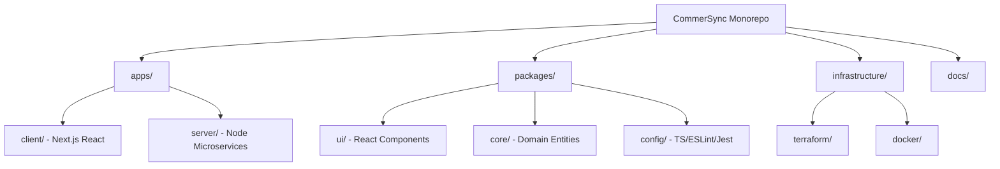
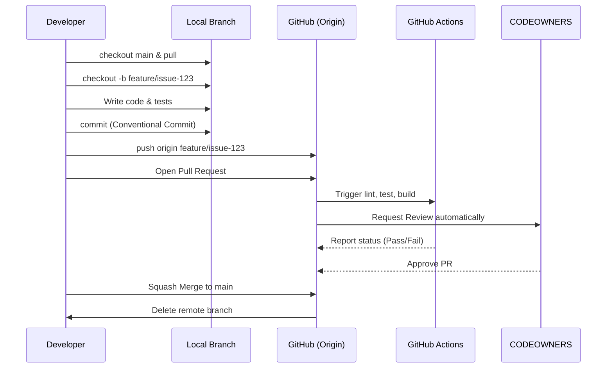
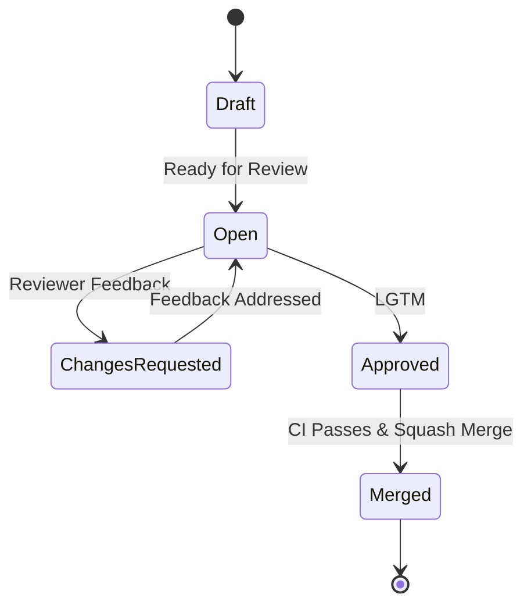

# CONTRIBUTING.md

## 1. Welcome

Welcome to **CommerSync**! We are thrilled to have you here.

As a Principal Staff Software Engineer and the Engineering Excellence Lead for this repository, I have designed this guide to be your definitive onboarding manual. CommerSync is an enterprise-grade platform built on a distributed, Event-Driven Architecture (EDA) using Domain-Driven Design (DDD) principles. Because we operate a complex Microservices ecosystem within a single Turborepo monorepo, maintaining high standards for code quality, consistency, and operational excellence is not just a goal—it is a strict requirement.

### Engineering Philosophy

- **Optimize for Reading Over Writing:** Code is read 10x more than it is written. Optimize your logic, variable names, and architecture for the next engineer who will read it.
- **Default to Automation:** If a task can be automated (linting, formatting, testing, deploying), it must be. We rely heavily on GitHub Actions to enforce our baselines.
- **Trunk-Based Delivery:** We integrate frequently and deploy continuously. Long-lived feature branches are an anti-pattern.
- **Collective Code Ownership:** While `CODEOWNERS` ensures domain experts review specific bounded contexts, any engineer can (and should) contribute anywhere in the repository to remove bottlenecks.

---

## 2. Before You Contribute

Before writing code, ensure your local development environment aligns with our enterprise baseline. Inconsistent environments lead to the classic "it works on my machine" anti-pattern.

### Required Tooling

| Tool        | Version         | Purpose                                                                        |
| ----------- | --------------- | ------------------------------------------------------------------------------ |
| **Git**     | `>= 2.30.0`     | Version control.                                                               |
| **Node.js** | `v20.x.x` (LTS) | JavaScript runtime for our backend and frontend services.                      |
| **pnpm**    | `>= 8.0.0`      | Our chosen package manager for deterministic monorepo resolution.              |
| **Docker**  | `>= 24.0.0`     | Containerization for local infrastructure (PostgreSQL, Redis, AWS LocalStack). |
| **AWS CLI** | `v2`            | Interacting with our cloud infrastructure.                                     |

### Repository Access

Ensure you have authenticated your Git client using an SSH key attached to your corporate GitHub account, and that Single Sign-On (SSO) is authorized for the CommerSync organization.

### Editor Recommendations

We recommend **Visual Studio Code (VSCode)**. The repository includes a `.vscode/` directory with recommended extensions (ESLint, Prettier, Docker, Dev Containers, Biome) and standardized workspace settings.

---

## 3. Repository Structure

CommerSync utilizes [Turborepo](https://turbo.build/) to manage our monorepo efficiently. We separate applications, microservices, and shared packages to enforce boundaries and optimize CI/CD caching.

### Architecture Overview



### Directory Breakdown

| Directory         | Purpose                                                       | Rules & Ownership                                           |
| ----------------- | ------------------------------------------------------------- | ----------------------------------------------------------- |
| `apps/client/`    | Frontend applications and customer-facing interfaces.         | Must consume `packages/ui`. No direct database connections. |
| `apps/server/`    | Node.js microservices (Domain Bounded Contexts).              | Strictly adheres to DDD and EDA patterns.                   |
| `packages/`       | Internal shared libraries (UI, Core domain logic, utilities). | Must be highly decoupled. No external side-effects.         |
| `docs/`           | Engineering handbooks, architecture Decision Records (ADRs).  | Markdown only. Keep up-to-date with code changes.           |
| `.github/`        | GitHub Actions workflows, issue templates, PR templates.      | Managed by the Platform Engineering team.                   |
| `scripts/`        | Shell and Node.js scripts for local dev and CI.               | Must be documented and idempotent.                          |
| `docker/`         | Dockerfiles and `docker-compose` manifests for local dev.     | Images must be built multi-stage to reduce size.            |
| `infrastructure/` | IaC (Infrastructure as Code) using Terraform.                 | Requires explicit approval from Cloud Ops.                  |

---

## 4. Development Workflow

We employ a strict contribution lifecycle to ensure code quality and prevent main-branch degradation.



### The Standard Path

1. **Sync:** Always pull the latest `main`.
2. **Branch:** Create a short-lived feature branch.
3. **Develop:** Write code, unit tests, and update documentation.
4. **Commit:** Use Conventional Commits.
5. **Push:** Push to the remote repository.
6. **Pull Request:** Open a PR against `main`. Fill out the PR template.
7. **CI/CD & Review:** Wait for automated checks to pass and secure an approval from a `CODEOWNER`.
8. **Merge:** Squash merge the PR.

---

## 5. Branch Strategy

We operate on a **Trunk-Based Development** model.

- `main` is sacred. It must be deployable at all times.
- Branches should be short-lived (maximum 2-3 days).
- If a feature takes longer, use Feature Toggles (LaunchDarkly/Optimizely) to merge incomplete code safely into `main` without exposing it to users.

For detailed rules on branch naming conventions and lifecycle management, you must read:
**👉 [docs/contributing/BRANCH_STRATEGY.md**](./docs/contributing/BRANCH_STRATEGY.md)

---

## 6. Commit Standards

We strictly enforce **Conventional Commits** via Husky and commitlint. This allows us to auto-generate changelogs and trigger semantic versioning releases.

Format: `<type>(<optional scope>): <description>`

### Common Commit Types

- `feat:` A new feature.
- `fix:` A bug fix.
- `docs:` Documentation only changes.
- `refactor:` A code change that neither fixes a bug nor adds a feature.
- `test:` Adding missing tests or correcting existing tests.
- `chore:` Changes to the build process or auxiliary tools.

_Example:_ `feat(auth): implement Redis-backed rate limiting for login`

For the comprehensive guide on structuring commits and managing breaking changes, see:
**👉 [docs/contributing/COMMIT_CONVENTION.md**](./docs/contributing/COMMIT_CONVENTION.md)

---

## 7. Pull Request Guidelines

Pull Requests are the gatekeepers of our repository. A well-crafted PR accelerates the review process.

### Lifecycle of a Pull Request



### How to Write a Good PR

- **Keep it Small:** PRs should ideally be under 400 lines of code. If it is larger, break it down into stacked PRs.
- **Context is King:** Explain _why_ the change is being made, not just _what_ was changed (the code shows the what).
- **Self-Review:** Always review your own code in the GitHub UI before requesting a review from others.
- **Template Compliance:** Our repository utilizes a `.github/pull_request_template.md`. You must fill it out completely, including attaching screenshots for UI changes and linking to Jira/Linear tickets.

---

## 8. CODEOWNERS

We utilize a strict `.github/CODEOWNERS` file to map bounded contexts and application directories to specific engineering squads.

### How It Works

1. When you open a PR, GitHub automatically parses the files you touched.
2. It assigns the required review groups based on the `CODEOWNERS` matrix.
3. **You cannot bypass this.** Branch protection rules require at least one approval from the designated owning team before the "Merge" button becomes active.

If your PR spans multiple domains (e.g., changing a shared UI package and a core backend service), you will need approvals from _both_ domain owners.

---

## 9. Development Standards

To maintain an enterprise-grade codebase, contributors must adhere to the following pillars:

- **Code Quality:** No warnings. Strict TypeScript compilation (`"strict": true` in `tsconfig.json`).
- **Architecture (DDD & EDA):** Services must not share databases. Cross-service communication must happen asynchronously via AWS EventBridge or Kafka, or synchronously via well-defined REST/gRPC interfaces.
- **Testing:** We follow the Testing Pyramid.
- _Unit Tests (Jest/Vitest):_ High coverage required for core domain logic.
- _Integration Tests:_ Validating database queries and caching layers.
- _E2E Tests (Playwright):_ Critical user journeys only.

- **Security:** Never hardcode secrets. Always use parameterized queries for PostgreSQL to prevent SQL injection. Sanitize all inputs at the API gateway level.
- **Performance:** Backend queries must be indexed. Frontend components must be lazy-loaded where applicable. Redis should be utilized for aggressive caching of read-heavy data.

---

## 10. CI/CD Expectations

Direct commits to `main` are cryptographically prevented. Every commit must pass through our GitHub Actions pipelines.

### The CI Pipeline

1. **Code Check:** Runs Prettier, ESLint, and Biome.
2. **Type Check:** Runs `tsc --noEmit` across the Turborepo.
3. **Test:** Executes Jest and Playwright test suites.
4. **Build:** Builds Docker containers and Next.js static assets.
5. **Security Scan:** Runs Dependabot, Snyk, and SonarQube for vulnerabilities and code smells.

If the CI pipeline fails, it is the contributor's responsibility to investigate the GitHub Actions logs, fix the issue, and push the patch to their branch.

---

## 11. Local Development

We utilize Turborepo and Docker Compose to make local environment spin-up frictionless.

### Standard Workflow

```bash
# 1. Install dependencies at the monorepo root
pnpm install

# 2. Start the local infrastructure (Postgres, Redis, LocalStack)
docker compose -f docker/docker-compose.yml up -d

# 3. Run database migrations
pnpm run db:migrate

# 4. Start the Turborepo dev server (spins up necessary apps and packages)
pnpm run dev

```

_Note: For specific service configuration, please refer to the `README.md` inside the respective `apps/` directory._

---

## 12. Reporting Bugs

If you find a bug, check the GitHub Issues tracker to ensure it hasn't already been reported. When filing a new bug, select the **Bug Report Template** and provide:

- A clear, descriptive title.
- Exact steps to reproduce the issue.
- Expected vs. actual behavior.
- Environment details (OS, Browser, Node version).
- Screenshots, screen recordings, or log dumps.

---

## 13. Suggesting Features

We welcome architectural enhancements and feature proposals!

- For minor enhancements, open an issue using the **Feature Request Template**.
- For major architectural changes (e.g., introducing a new database, changing a core pattern), you must write an **Architecture Decision Record (ADR)** and submit it as a PR to the `docs/architecture/` directory for the Staff Engineering team to review.

---

## 14. Security Reporting

**DO NOT REPORT SECURITY VULNERABILITIES IN PUBLIC ISSUES OR PULL REQUESTS.**

If you discover a security flaw (e.g., an unauthorized data exposure, XSS, SSRF), please email our security team directly at `[PLACEHOLDER_SECURITY_EMAIL@COMMERSYNC.COM]`. We operate a responsible disclosure program and will respond within 24 hours.

---

## 15. Documentation Contributions

Documentation is treated as a first-class citizen alongside our code.

- **Markdown:** All documentation must be written in standard Markdown (`.md`).
- **Location:** \* System-wide docs belong in `docs/`.
- App-specific or package-specific docs belong in the `README.md` at the root of that app/package.

- **API Docs:** We use OpenAPI (Swagger). Do not manually write API docs; annotate the code and allow the CI pipeline to generate the specification.

---

## 16. Best Practices

Strict adherence to these 25 best practices is expected from all engineers.

| #      | Category     | Best Practice                  | Description                                                                                      |
| ------ | ------------ | ------------------------------ | ------------------------------------------------------------------------------------------------ | -------------------------- |
| **1**  | Architecture | **Bounded Contexts**           | Never bypass an API to access another microservice's database directly.                          |
| **2**  | Architecture | **Idempotency**                | All Event-Driven consumers must be idempotent to handle retries without side effects.            |
| **3**  | Architecture | **Eventual Consistency**       | Design UIs and flows assuming eventual consistency for distributed transactions.                 |
| **4**  | Architecture | **Fail Fast**                  | Validate inputs at the system edge. Throw errors immediately on invalid data.                    |
| **5**  | Architecture | **Graceful Degradation**       | If a non-critical downstream service fails, the main application should still function.          |
| **6**  | TypeScript   | **Strict Typing**              | Avoid `any` at all costs. Use `unknown` if the shape is truly ambiguous, then type-narrow.       |
| **7**  | TypeScript   | **Discriminated Unions**       | Use tagged unions for state management and complex API responses over optional properties.       |
| **8**  | TypeScript   | **Readonly by Default**        | Use `readonly` arrays and properties for data that should not be mutated.                        |
| **9**  | TypeScript   | **Utility Types**              | Leverage `Pick`, `Omit`, and `Record` rather than duplicating interface declarations.            |
| **10** | TypeScript   | **Avoid Enums**                | Prefer string literal union types (`type Status = 'OPEN'                                         | 'CLOSED'`) over TS `enum`. |
| **11** | Testing      | **Arrange, Act, Assert**       | Structure unit tests strictly into Setup (Arrange), Execution (Act), and Verification (Assert).  |
| **12** | Testing      | **Mock Boundaries, Not Logic** | Mock external APIs and databases, but do not mock internal domain logic.                         |
| **13** | Testing      | **Test Behaviors**             | Test what the code _does_, not _how_ it is implemented (avoid testing private methods directly). |
| **14** | Testing      | **Deterministic Tests**        | Tests should not rely on the current system time, timezones, or random network states.           |
| **15** | Testing      | **Data Builders**              | Use factory patterns for generating test data rather than hardcoded objects.                     |
| **16** | Git / PRs    | **Atomic Commits**             | A single commit should represent a single logical change.                                        |
| **17** | Git / PRs    | **Rebase over Merge**          | When updating your feature branch from `main`, use `git rebase main` to keep history linear.     |
| **18** | Git / PRs    | **Draft PRs**                  | Open PRs as "Draft" if you just want to run CI or get early architectural feedback.              |
| **19** | Git / PRs    | **Self-Documentation**         | If code needs explaining in a PR comment, it likely needs a comment in the actual source code.   |
| **20** | Git / PRs    | **Actionable Feedback**        | Reviewers should clearly distinguish between "Nit/Optional" suggestions and "Blocking" changes.  |
| **21** | Performance  | **Pagination**                 | All list-returning APIs must implement pagination (Cursor-based preferred over Offset).          |
| **22** | Performance  | **Connection Pooling**         | Always use PgBouncer or standard pooling configurations when connecting to PostgreSQL.           |
| **23** | Performance  | **N+1 Query Prevention**       | Use DataLoader in GraphQL or carefully structured JOINs in REST to prevent N+1 queries.          |
| **24** | Security     | **Least Privilege**            | AWS IAM roles and database users should only have permissions required for their task.           |
| **25** | General      | **Leave it Better**            | The Boy Scout Rule: Always leave the codebase cleaner than you found it.                         |

---

## 17. Common Mistakes

Avoid these 20 frequent pitfalls that block PR approvals and cause production incidents.

| #      | Mistake                                           | How to Avoid It                                                                                     |
| ------ | ------------------------------------------------- | --------------------------------------------------------------------------------------------------- |
| **1**  | Pushing massive Pull Requests.                    | Break work into smaller, incremental PRs. Aim for < 400 LOC.                                        |
| **2**  | Committing secrets or `.env` files.               | Never commit `.env`. Ensure `.gitignore` is properly configured. Use git-secrets.                   |
| **3**  | Force pushing (`git push -f`) on shared branches. | Only force push to your own personal feature branches, never to `main` or shared branches.          |
| **4**  | Using `ts-ignore` to bypass type errors.          | Fix the root type issue. If unavoidable, use `ts-expect-error` with a detailed explanation comment. |
| **5**  | Creating merge commits in feature branches.       | Always `git rebase main` to pull in new changes to avoid "spaghetti" commit graphs.                 |
| **6**  | Forgetting to add database migrations.            | If changing an entity, generate a migration file and test both `up` and `down` methods.             |
| **7**  | Mutating function arguments.                      | Treat parameters as immutable. Return new objects instead of modifying inputs.                      |
| **8**  | Relying on synchronous microservice calls.        | Use asynchronous events (Kafka/SQS) to prevent cascading timeouts across services.                  |
| **9**  | Hardcoding environment variables.                 | Use the configuration package (`packages/config`) which strictly validates ENVs at runtime via Zod. |
| **10** | Skipping tests for "simple" changes.              | All changes require tests. Bugs hide in "simple" edge cases.                                        |
| **11** | Building dependencies locally instead of CI.      | Never commit `dist/` or `build/` artifacts. Let GitHub Actions compile them.                        |
| **12** | Writing non-idempotent database scripts.          | Ensure scripts can be run multiple times safely (e.g., use `INSERT ... ON CONFLICT`).               |
| **13** | Ignoring CI failures.                             | Do not request a review if your CI build is red. Fix lint/build errors first.                       |
| **14** | Over-fetching data in the UI.                     | Only query the fields necessary for the component. Utilize GraphQL carefully.                       |
| **15** | Failing to handle Promise rejections.             | Always use `try/catch` with `async/await`, or attach `.catch()` handlers to promises.               |
| **16** | Leaking memory in Node.js.                        | Avoid storing unbounded data in global arrays/objects or failing to close database connections.     |
| **17** | Using arbitrary magic numbers.                    | Extract numbers to named constants (e.g., `const MAX_RETRY_COUNT = 3;`).                            |
| **18** | Breaking the UI package boundaries.               | Do not import `apps/client` logic into `packages/ui`. UI must remain completely dumb and reusable.  |
| **19** | Writing tightly coupled tests.                    | Do not test multiple services in a unit test. Mock the boundaries.                                  |
| **20** | Ghosting PR reviews.                              | If you are assigned as a reviewer, provide feedback or reassign within 24 hours.                    |

---

## 18. Frequently Asked Questions

**1. How do I create a feature branch?**
Always branch from the latest `main`. Use the format: `git checkout -b <type>/<ticket-number>-<short-desc>` (e.g., `git checkout -b feat/COM-123-user-auth`).

**2. How do I update my branch with the latest changes from main?**
While on your branch, run `git fetch origin` followed by `git rebase origin/main`. Resolve any conflicts, then `git push -f origin <your-branch>`.

**3. Can I push directly to main?**
No. Branch protection rules mathematically enforce that all commits to `main` must come through a reviewed and CI-passed Pull Request.

**4. Who reviews my Pull Request?**
The `.github/CODEOWNERS` file will automatically request reviews from the specific team responsible for the directories you modified.

**5. How do CODEOWNERS work?**
It is a GitHub feature that enforces mandatory reviews from specific groups based on file paths. You need approval from the owner of _every_ directory your PR touches.

**6. How should I write commit messages?**
We use Conventional Commits. See [Commit Standards](#6-commit-standards).

**7. Why is my CI build failing on the "Lint" step?**
You likely have formatting or unused variable issues. Run `pnpm run lint --fix` locally to resolve them before pushing.

**8. What is Turborepo doing?**
Turborepo orchestrates our monorepo tasks. It caches build and test outputs based on file hashes. If you haven't changed a package, Turbo will skip rebuilding it, saving massive amounts of time.

**9. How do I add a new package to the monorepo?**
Create a new directory in `packages/`, initialize a `package.json`, set the name to `@commersync/<pkg-name>`, and run `pnpm install` at the root to link it workspace-wide.

**10. How do I access the local database?**
The local PostgreSQL instance runs via Docker on port `5432`. Credentials are in the `docker/docker-compose.yml` file.

**11. Why did my Squash Merge fail?**
Squash merges require the PR title to conform to our Conventional Commit standards, as the PR title becomes the final commit message on `main`.

**12. Can I use a different package manager?**
No. You must use `pnpm`. `npm` or `yarn` will break the `pnpm-lock.yaml` file, causing CI failures.

**13. Do I need to write an ADR?**
If your PR changes a core architectural pattern, introduces a new infrastructure component, or changes cross-service communication, yes.

**14. What happens if I break main?**
Alert the team immediately in the `#engineering-incidents` Slack channel. You are expected to either submit a highly expedited fix forward or click "Revert" on your PR.

**15. How do I test GitHub Actions locally?**
Use `act` or simply rely on the CI runners. It is usually easier to open a Draft PR and let the GitHub runners execute the workflow.

**16. Why do we enforce Trunk-Based Development?**
To avoid "merge hell." Frequent, small integrations reduce risk and accelerate feature delivery.

**17. What if my PR requires a database migration?**
The migration file must be included in the same PR as the application code changes. CI will run the migration against a temporary database to verify it.

**18. How are secrets managed?**
Locally, copy `.env.example` to `.env`. For production, secrets are injected via AWS Secrets Manager. Never hardcode secrets.

**19. My PR spans the frontend and backend. Should it be one PR?**
Yes, thanks to the monorepo. This allows you to ship the API and the UI that consumes it in a single atomic, type-safe change.

**20. What is a Bounded Context?**
A DDD concept representing a linguistic and logical boundary. E.g., the `Billing` service should know nothing about the internal logic of the `Shipping` service.

**21. How do I format my code?**
You don't need to do it manually. We use Prettier/Biome. Ensure your VSCode format-on-save is enabled.

**22. I am blocked on a PR review. What do I do?**
Reach out to the assigned CODEOWNER team in their dedicated Slack channel with a link to your PR.

**23. Can I mock the database in integration tests?**
No. Integration tests should hit a real (ephemeral) local database spun up by Testcontainers or Docker Compose. Mocking is for unit tests only.

**24. How do we handle feature flags?**
We use LaunchDarkly. Wrap incomplete UI or backend logic in a feature flag so it can be merged safely to `main` without exposing it to customers.

**25. Where do I get help?**
Join the `#engineering-help` Slack channel or reach out to your team lead. We are highly collaborative and optimize for blameless problem-solving.

---

## 19. Engineering Documentation Index

This guide is your starting point. For deep dives into specific engineering topics, consult the central documents listed below.

| Document               | Location                                 | Purpose                                                                              |
| ---------------------- | ---------------------------------------- | ------------------------------------------------------------------------------------ |
| **Branch Strategy**    | `docs/contributing/BRANCH_STRATEGY.md`   | Detailed rules on Trunk-Based Development, branch naming, and release cycles.        |
| **Commit Convention**  | `docs/contributing/COMMIT_CONVENTION.md` | Complete glossary of commit types, scopes, and automated changelog generation rules. |
| **Code Ownership**     | `.github/CODEOWNERS`                     | The source of truth for repository review permissions and domain ownership.          |
| **PR Template**        | `.github/pull_request_template.md`       | The standardized checklist required for all Pull Requests.                           |
| **Root README**        | `README.md`                              | High-level project summary and quick-start setup instructions.                       |
| **Architecture Index** | `docs/architecture/README.md`            | The repository for all active and historical Architecture Decision Records (ADRs).   |
| **Security Playbook**  | `docs/security/INCIDENT_RESPONSE.md`     | Internal guidelines for handling zero-days, patches, and security escalations.       |

---

## 20. Final Contributor Checklist

Before you hit "Create Pull Request", verify you have completed the following steps. This will save you and your reviewers significant time.

| ✅  | Requirement           | Description                                                                              |
| --- | --------------------- | ---------------------------------------------------------------------------------------- |
| [ ] | **Self-Review**       | I have reviewed my own code diff in the GitHub UI.                                       |
| [ ] | **CI Local Check**    | I have run `pnpm lint`, `pnpm build`, and `pnpm test` locally and they pass.             |
| [ ] | **Branch Rebase**     | My branch is up to date with `main` (no merge conflicts).                                |
| [ ] | **Commit Formatting** | All my commits adhere to the Conventional Commits specification.                         |
| [ ] | **Documentation**     | I have updated the `README.md` or relevant `docs/` if my changes alter system behavior.  |
| [ ] | **Testing**           | I have added or updated Unit and Integration tests for my changes.                       |
| [ ] | **PR Template**       | I have fully completed the PR description and checked all internal template boxes.       |
| [ ] | **Visual Evidence**   | (If UI change) I have attached before/after screenshots or screen recordings to the PR.  |
| [ ] | **Security**          | I have verified no credentials, secrets, or sensitive PII logic is exposed in this diff. |
