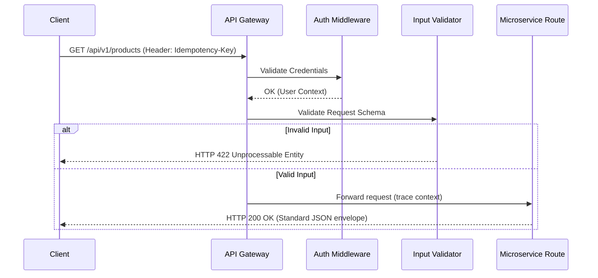

# CommerSync API Design & REST Engineering Handbook

> **Document Status:** Approved  
> **Version:** 1.0.0  
> **Audience:** All Engineers, Frontend Developers, Integrators, SREs  
> **Applies To:** Entire CommerSync Platform (External HTTP REST APIs, Internal
> API Gateway, Service APIs)

---

## Executive Summary

At CommerSync's scale, the API is the primary boundary of our microservices. A
consistent, predictable, and high-performance API design ensures:

- **Optimal Consumer Experience:** Client developers can consume any service API
  without learning different routing, filtering, or error formats.
- **Long-Term Maintainability:** Services can evolve their underlying databases
  and business logic independently as long as their public API contracts remain
  unchanged.
- **Predictable Performance:** Standardized pagination, sparse field selection,
  and resource expansion prevent over-fetching and query performance
  bottlenecks.

---

## 1. API Design Philosophy

### 1.1 APIs Represent Business Resources

- **Rule:** API paths must map directly to logical domain resources, never to
  RPC-style server functions.
- **Why:** Resource-oriented architecture provides a stable, intuitive structure
  that aligns with our relational schemas.

### 1.2 Consistency over Creativity

- **Rule:** Standardize all API interfaces. Route layout, envelope formatting,
  pagination parameters, sorting queries, and error shapes must be identical
  across all 15+ microservices.
- **Why:** Eliminates the integration overhead for clients consuming multiple
  services.

### 1.3 Backward Compatibility First

- **Rule:** Once an API version is deployed to production, breaking changes are
  strictly prohibited. Updates that alter behavior or delete fields must move to
  a new major version (e.g., `/api/v2/`).
- **Why:** A single breaking change can crash downstream client applications,
  checkouts, or external webhooks.

### 1.4 Consumer-First Design

- **Rule:** Design APIs from the client's perspective. Do not expose internal
  database schemas or microservice structure directly.
- **Why:** Clients need clean models designed for their UI rendering paths, not
  raw relational table rows.

---

## 2. REST Resource Design & URL Naming

### 2.1 URL Structure Guidelines

- **Format:** Lowercase words separated by hyphens (kebab-case). Resource names
  must be **plural** nouns.
- **No Verbs in Paths:** Paths represent nouns; HTTP methods represent verbs.
- **Nesting Limit:** Route nesting must not exceed a depth of 2 resources.

| URL Pattern                 | Purpose                  | Correct                      | Incorrect                                |
| --------------------------- | ------------------------ | ---------------------------- | ---------------------------------------- |
| `/api/v1/products`          | Retrieve collection      | `GET /api/v1/products`       | `GET /api/v1/get-products`               |
| `/api/v1/products/{id}`     | Access resource          | `GET /api/v1/products/123`   | `GET /api/v1/product?id=123`             |
| `/api/v1/orders/{id}/items` | Access nested collection | `GET /api/v1/orders/5/items` | `GET /api/v1/orders/5/items/12/shipment` |

---

## 3. HTTP Methods

We enforce strict mapping of HTTP verbs to execution behaviors:

| Method     | Action                            | Idempotent? | Safe? | Description                                  |
| ---------- | --------------------------------- | ----------- | ----- | -------------------------------------------- |
| **GET**    | Retrieve resource/collection      | Yes         | Yes   | Reads data; must have no side effects        |
| **POST**   | Create resource or trigger action | No          | No    | Writes new records; triggers payments/emails |
| **PUT**    | Replace resource entirely         | Yes         | No    | Complete replace update of the resource      |
| **PATCH**  | Update resource partially         | No          | No    | Updates only the keys provided in the body   |
| **DELETE** | Remove resource                   | Yes         | No    | Soft-deletes or purges the target resource   |

---

## 4. API Versioning Strategy

### 4.1 URI Versioning Policy

- **Rule:** Major versions must be declared directly in the URL path:
  `/api/v{major}/`.
- **Why:** Path-based versioning is explicit, transparent, caches cleanly on
  CDNs, and works across browsers without custom headers.

### 4.2 Non-Breaking vs. Breaking Changes

| Non-Breaking (Allowed in `v1`)            | Breaking (Requires `v2`)                     |
| ----------------------------------------- | -------------------------------------------- |
| Adding a new optional field               | Renaming or removing a field                 |
| Adding a new HTTP endpoint                | Changing a field's data type                 |
| Supporting a new optional query parameter | Removing support for an existing HTTP method |

---

## 5. Success Response Envelope

Every successful API response must match this standard JSON envelope structure:

```json
{
  "success": true,
  "data": {},
  "meta": {
    "timestamp": "2026-07-13T10:00:00.000Z"
  }
}
```

### Response Fields:

- `success`: Set to `true` (enables simple boolean client checks).
- `data`: Holds the primary resource object or array of items.
- `meta`: Contains metadata (e.g., pagination details, diagnostic metrics).

---

## 6. Pagination Standards

### 6.1 Cursor Pagination (Enforced for Large Collections)

For collections exceeding $10,000$ entries, cursor-based pagination is required
to prevent database offset degradation.

#### Response Format

```json
{
  "success": true,
  "data": [{ "id": "prod_1" }],
  "meta": {
    "pagination": {
      "hasNextPage": true,
      "endCursor": "eyJpZCI6ICJwcm9kXzEifQ==",
      "limit": 10
    }
  }
}
```

---

## 7. Filtering, Sorting, and Searching

Standardize query parameters to match this format:

- **Filtering (Equality):** `GET /api/v1/products?category=shoes`
- **Filtering (Range):** `GET /api/v1/products?price[min]=100&price[max]=500`
- **Sorting:** `GET /api/v1/products?sort=-created_at` (prefix `-` denotes
  descending order)
- **Searching:** `GET /api/v1/products?q=running`
- **Sparse Fields:** `GET /api/v1/products?fields=id,name,price` (prevents
  over-fetching payloads)
- **Expansion:** `GET /api/v1/products?include=category,images` (resolves
  relationships in one query, avoiding N+1 requests)

---

## 8. Bulk Operations

- **Rule:** For batch creation or updates, define a `/bulk` resource path. The
  payload must be a JSON array.
- **Partial Failures:** Bulk requests must return a `207 Multi-Status` response,
  detailing the outcome of each individual item, rather than failing the entire
  request.

---

## 9. Idempotency

- **Rule:** Any write method (POST/PATCH) that is retryable must accept an
  `Idempotency-Key` header.
- **Why:** Prevents charging a credit card twice or duplicate order creation
  during network drops or retries.

---

## 10. Rate Limiting

CommerSync services must return standard rate-limiting headers on all responses:

```http
X-RateLimit-Limit: 100
X-RateLimit-Remaining: 99
X-RateLimit-Reset: 177891238
```

If exceeded, return `429 Too Many Requests` with a `Retry-After` header
indicating wait time in seconds.

---

## 11. Request Lifecycle Pipeline



---

## 12. Quick Reference Cheat Sheet

- **Rule 1:** Paths use plural nouns, lowercase, kebab-case
  (`/api/v1/order-items`).
- **Rule 2:** Version in URI `/api/v1/`.
- **Rule 3:** Success response matches `{"success": true, "data": ...}`.
- **Rule 4:** Error responses match the
  [Error Handling Standard](file:///Users/Projects/CommerSync/docs/engineering/error-handling.md#L45).
- **Rule 5:** Non-idempotent updates require an `Idempotency-Key` header.
- **Rule 6:** Large listings must implement cursor-based pagination.
