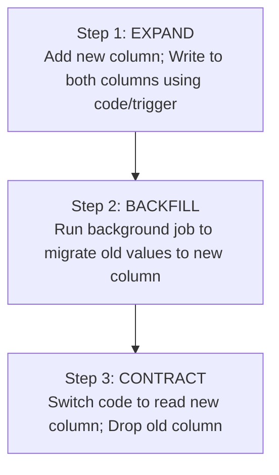

# CommerSync Database Engineering Standards Handbook

> **Document Status:** Approved  
> **Version:** 1.0.0  
> **Audience:** All Engineers, Database Engineers, Tech Leads, SREs  
> **Applies To:** Entire CommerSync Platform (PostgreSQL, Prisma schema files,
> database migrations)

---

## Executive Summary

For an enterprise platform of CommerSync's scale, the database is the foundation
of truth. When databases are poorly designed, named inconsistently, or evolved
via manual scripts, it leads to system instability, query performance
degradation, data corruption, and deployment failures.

Centralized database consistency directly impacts:

- **Data Integrity:** Enforcing explicit constraints at the database engine
  level (rather than relying on application code) prevents corrupt states.
- **Developer Productivity:** Every microservice uses identical database
  schemas, mapping protocols, and naming rules, which speeds up engineering
  hand-offs.
- **Performance & Scalability:** Standardized index naming, pagination patterns,
  and query guidelines prevent common database lock conflicts and N+1
  performance bottlenecks.
- **Maintainability & Rollbacks:** Standardized zero-downtime migrations ensure
  that database upgrades can be performed during production hours without
  downtime.

---

## 1. Database Design Philosophy

### 1.1 Data Integrity First

- **Rule:** The database is the final guardian of data consistency. All critical
  relationships, domains, and rules must be enforced using constraints
  (`FOREIGN KEY`, `UNIQUE`, `CHECK`, `NOT NULL`) at the PostgreSQL engine level,
  rather than relying exclusively on application code.
- **Why:** Application servers can scale, crash, bypass validation during
  scripts, or have race conditions. Relational engines run constraints
  transactionally, ensuring invalid data can never be written.

### 1.2 Normalize Before Denormalizing

- **Rule:** Standardize schemas to Third Normal Form (3NF) by default.
  Denormalization is only allowed after performance testing proves a query
  bottleneck, and must be backed by an approved ADR.
- **Why:** Normalization minimizes data redundancy, eliminates write anomalies,
  and simplifies transactional updates.

### 1.3 Backward-Compatible Schema Evolution

- **Rule:** All schema migrations must be backward-compatible with the
  immediately preceding version of the application code. Breaking changes must
  follow the "Expand-Contract" pattern over multiple deployment cycles.
- **Why:** A rolling blue-green deployment means both old and new versions of
  the service run simultaneously against the database. A breaking schema change
  (e.g., dropping a column) will crash the old version.

---

## 2. PostgreSQL Standards

### 2.1 Core Strategy Configs

We enforce a strict configuration baseline for all PostgreSQL instances:

| Configuration          | Standard                          | Rationale                                                        |
| ---------------------- | --------------------------------- | ---------------------------------------------------------------- |
| **Version**            | PostgreSQL 16 (LTS)               | Support for native logical replication performance improvements  |
| **Character Encoding** | `UTF8`                            | Complete internationalization and emoji support                  |
| **Timezone Strategy**  | `UTC`                             | Standardized database timezone; avoids daylight saving offsets   |
| **UUID Strategy**      | UUID v4                           | High collision resistance; ideal for distributed systems         |
| **Numeric Precision**  | `NUMERIC(12, 2)` or integer cents | Money fields must be typed explicitly to prevent rounding errors |

### 2.2 JSONB Usage

- **Rule:** Use `JSONB` only for schema-less data, dynamic attributes,
  third-party payload dumps, or highly dynamic metadata. Do not store relational
  data in JSON fields.
- **Why:** Relational engines lose constraint verification and query indexing
  capabilities inside JSON documents. JSONB data mutations require heavy rewrite
  cycles.

### 2.3 CITEXT (Case-Insensitive Text)

- **Rule:** Email addresses, usernames, and search slugs must use the `citext`
  extension or be lowercased before insert.
- **Why:** Prevents duplicate accounts resulting from casing anomalies (e.g.,
  `Tarun@example.com` and `tarun@example.com`).

---

## 3. Prisma Standards

### 3.1 Model & Schema Mapping

- **Rule:** Prisma models must use `PascalCase` and columns must use
  `camelCase`. Every model and field must use `@map` and `@@map` to target
  PostgreSQL's standard `snake_case` naming.
- **Why:** Bridges the case convention gap. TypeScript standard is `camelCase`,
  but PostgreSQL queries are case-sensitive when using capital letters,
  requiring double quotes in raw SQL queries.

#### Good Example

```prisma
model OrderDetail {
  id        String   @id @default(uuid()) @db.Uuid
  orderId   String   @map("order_id") @db.Uuid
  productId String   @map("product_id") @db.Uuid
  createdAt DateTime @default(now()) @map("created_at")

  @@map("order_details")
}
```

#### Bad Example

```prisma
// Missing mapping attributes. Causes tables and columns to inherit
// PascalCase/camelCase in PostgreSQL, forcing quotes in SQL queries.
model OrderDetail {
  id        String @id
  orderId   String
  productId String
}
```

---

## 4. Naming Standards

### 4.1 Table Naming

- **Rule:** Tables must be named using plural nouns in `snake_case` (e.g.,
  `users`, `order_items`). Junction tables must combine both resource names in
  alphabetical order (e.g., `products_tags`).

### 4.2 Column Naming

- **Primary Keys:** Standardize on `id`.
- **Foreign Keys:** Suffix with `_id` (e.g., `user_id`).
- **Timestamps:** Suffix with `_at` (e.g., `created_at`, `updated_at`,
  `deleted_at`).
- **Booleans:** Prefix with `is_`, `has_`, or `should_` (e.g., `is_active`,
  `has_permission`).

---

## 5. Primary Key Strategy

### UUID vs. BIGINT (Surrogate Keys)

We enforce **UUID v4** for all public-facing primary keys:

| Key Type              | Pros                                                            | Cons                                                                      | Chosen For                                      |
| --------------------- | --------------------------------------------------------------- | ------------------------------------------------------------------------- | ----------------------------------------------- |
| **UUID v4**           | Un-guessable, secure, can be generated offline by clients       | 16-byte size, indexes are slightly slower due to lack of sequential order | All external entities (Users, Products, Orders) |
| **BIGINT (Identity)** | Sequential, small footprint (8-byte), highly optimized indexing | Leakable sequential count (vulnerable to scraping)                        | Internal lookup tables, logs                    |

---

## 6. Index & Constraint Naming Standards

Every index and constraint must follow a strict naming prefix scheme to allow
automated database schema validation:

```
pk_<table_name>                             # Primary Key
fk_<table_name>_<column_name>               # Foreign Key
uq_<table_name>_<column_names>              # Unique Constraint
idx_<table_name>_<column_names>             # Standard B-tree Index
gin_<table_name>_<column_names>             # GIN Index (for JSONB/Search)
ck_<table_name>_<check_condition>           # Check Constraint
```

### Good Examples:

- `pk_users`
- `fk_orders_user_id`
- `idx_products_category_id`
- `ck_orders_total_positive`

---

## 7. Migration Standards

### 7.1 Zero-Downtime Migration Patterns

- **Rule:** No migrations should block or lock table reads/writes during
  production hours.
- **One Concern per Migration:** Never combine column updates, index creation,
  and data backfills in a single migration script.

### 7.2 Safe Schema Updates (Expand-Contract)

To rename or modify a column without downtime, follow this three-step pattern:



---

## 8. Soft Delete Standards

### Rule

Use `deleted_at` (timestamp with timezone, nullable) for entities where soft
deletion is required (e.g., `products`, `users`).

### Query & Indexing Strategy

- To prevent performance degradation, tables using soft delete must create a
  **partial index** on active records:
  ```sql
  CREATE INDEX idx_products_active ON products(id) WHERE deleted_at IS NULL;
  ```
- Prisma queries must filter out deleted records explicitly in their where
  filters:
  ```typescript
  prisma.product.findMany({ where: { deletedAt: null } });
  ```

---

## 9. JSONB Guidelines & Limitations

- **Allowed:** Storing dynamic webhook payload dumps from Stripe, metadata
  extensions, localized product descriptions.
- **Forbidden:** Storing references to foreign IDs (must use foreign keys),
  storing arrays of items that require transactional queries.

---

## 10. Performance Standards

- **N+1 Query Prevention:** Always fetch relations using Prisma `include` or
  explicit sub-queries. Never loop over a record list and query the database
  inside the loop.
- **Pagination:** Use cursor-based pagination (`take`, `cursor`) for large
  datasets. Avoid offset-based pagination (`skip`) on tables with $>10,000$
  records due to SQL scan performance penalty.

---

## 11. Security Standards

- **Data Masking:** PII fields (like passwords, keys) must be hashed or
  encrypted using `pgcrypto` functions or before saving via TypeScript crypt
  engines.
- **SQL Injection Prevention:** Never concatenate strings in Prisma `$queryRaw`
  queries. Always use template literals where parameters are automatically
  bound.

---

## 12. Quick Reference Cheat Sheet

- **Rule 1:** Table names must be plural, lowercase, `snake_case`.
- **Rule 2:** Primary keys are `id` typed as `UUID`.
- **Rule 3:** Timestamps use `TIMESTAMPTZ` UTC timezone format.
- **Rule 4:** Prefix constraints: `pk_`, `fk_`, `uq_`, `idx_`, `ck_`.
- **Rule 5:** Always map Prisma names to database names using `@map` and
  `@@map`.
- **Rule 6:** Never use `throw` inside transaction blocks without rolling back.
