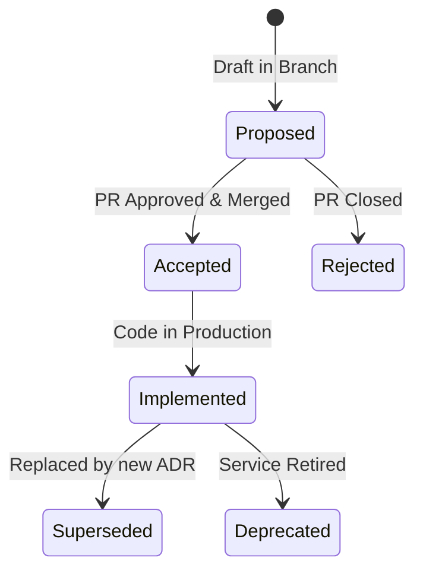

# CommerSync Engineering Documentation Standards Handbook

> **Document Status:** Approved  
> **Version:** 1.0.0  
> **Audience:** All Engineers, Tech Leads, SREs, Product Managers, New Hires  
> **Applies To:** Entire CommerSync Platform (System design, repositories, APIs,
> services, packages, operations)

---

## Executive Summary

In a distributed, enterprise-scale software platform, documentation is not an
optional post-script; it is a **core engineering deliverable**. When engineering
knowledge remains tribal or is documented inconsistently:

- **Onboarding Time Inflates:** New hires spend weeks asking questions instead
  of reading self-service setup guides.
- **Operational Risk Escalates:** During an active SEV1 incident, SREs waste
  time guessing service dependencies or searching for outdated rollback
  commands.
- **Technical Debt Accelerates:** Teams duplicate implementations because they
  cannot discover existing shared utilities.

Consistent, high-quality documentation directly increases velocity, simplifies
maintenance, secures knowledge, and mitigates operational outages.

---

## 1. Documentation Philosophy

### 1.1 Documentation is Code

- **Rule:** Documentation must be treated with the same rigor as source code. It
  must be version controlled, peer-reviewed via Pull Requests, and linted for
  formatting and broken links.
- **Why:** If documentation is separate from the codebase, it falls out of sync,
  rendering it untrustworthy.

### 1.2 Document the "Why," Not Just the "What"

- **Rule:** Code shows _how_ the system works. Variable/method signatures show
  _what_ the system does. Documentation must explain **why** the system is
  designed this way, capturing constraints, business assumptions, and
  alternatives rejected.
- **Why:** Code syntax cannot reveal historical context or architectural
  constraints.

### 1.3 Maintain Single Source of Truth

- **Rule:** Every piece of information must have a single authoritative home.
  Never duplicate documentation across different folders or wikis. Use
  hyperlinks to reference shared docs.
- **Why:** Duplication leads to contradiction when one copy is updated and the
  other is forgotten.

### 1.4 Assign Clear Ownership

- **Rule:** Every document must declare an owning team or code-owner role.
  Unowned documentation is deprecated by default.
- **Why:** Ownership guarantees accountability for keeping documentation current
  as the system evolves.

---

## 2. Documentation Categories

We classify engineering documents to clarify their target audience and update
frequencies:

| Category               | Target Audience                    | Owner               | Update Trigger                                 |
| ---------------------- | ---------------------------------- | ------------------- | ---------------------------------------------- |
| **Service README**     | Developers, Integrators            | Owning Service Team | Every code change affecting build/run/config   |
| **Package README**     | Monorepo Developers                | Shared Package Team | API change, release tag                        |
| **API Docs (OpenAPI)** | Frontend Developers, API Consumers | Owning API Team     | Route change, payload modification             |
| **ADR**                | Staff Engineers, Architects        | Architecture Team   | Architectural milestone, tool/framework change |
| **RFC**                | Domain Engineers                   | Proposed Author     | Feature design phase                           |
| **Runbook**            | SREs, On-call Engineers            | SRE / DevOps Team   | Alert addition, deployment deployment changes  |

---

## 3. Directory Layout

The `docs/` folder must follow this standardized directory layout:

```
docs/
├── adr/               # Architecture Decision Records (e.g. ADR-001-...)
├── architecture/      # High-level C4 context, event-flow, and database schemas
├── runbooks/          # Operational step-by-step guides for on-call SREs
├── rfc/               # Proposed Request for Comments documents
├── operations/        # Incident postmortems, backup and rollback strategies
└── guides/            # Local developer onboarding, styling, and setup guides
```

---

## 4. Architectural Decision Records (ADRs)

### 4.1 When to Create an ADR

An ADR must be created whenever an engineering choice has a global impact on the
platform's non-functional requirements (security, latency, scalability,
maintainability) or coding conventions (e.g.,
[typescript-style-guide](file:///Users/Projects/CommerSync/docs/engineering/typescript-style-guide.md)).

### 4.2 ADR Lifecycle



### 4.3 ADR Markdown Template

Save ADR files as `docs/adr/ADR-NNN-kebab-case-title.md` using this template:

```markdown
# ADR-NNN: [Descriptive Imperative Title]

## Status

[Proposed | Accepted | Implemented | Rejected | Superseded by ADR-XXX]

## Context

[Describe the technical, operational, or business problem we are solving. What
are the constraints?]

## Decision

[Clearly state the chosen solution. Use active voice, e.g. "We will use
PostgreSQL CITEXT..."]

## Rationale

[Explain why this solution was chosen over alternatives.]

## Consequences

### Positive

- [Benefit 1]

### Negative

- [Cost/Complexity 1]

## Trade-offs

- [e.g., Trading higher initial setup for long-term type safety]

## References

- [Links to relevant code, guides, or external docs]
```

---

## 5. Service README Standards

Every microservice under `server/services/*` must contain a `README.md`
conforming to this layout:

````markdown
# @server/[service-name]

## Business Purpose

[Describe what business domain this service owns, e.g., "Manages shopping carts
and item persistence."]

## Architecture & Layers

[C4 context diagram or text summary of controllers, services, database models.]

## Dependencies

- **Database:** PostgreSQL (details: database-conventions.md)
- **Upstream APIs:** None
- **Downstream APIs:** `@server/auth-service`

## Configuration & Env Variables

| Variable       | Default | Purpose                      |
| -------------- | ------- | ---------------------------- |
| `PORT`         | `4001`  | Listen port                  |
| `DATABASE_URL` | None    | PostgreSQL connection string |

## Local Development

```bash
pnpm install
pnpm dev
```
````

## Production Deployment

- **Container Registry:** Amazon ECR (`auth-service`)
- **Deployment Target:** AWS ECS Fargate
- **Deployment Pipeline:** `.github/workflows/deploy-auth-service.yml`

````

---

## 6. Runbook Standards

Runbooks must reside in `docs/runbooks/` and be named after the target alert:

```markdown
# Runbook: [ALERT_NAME]

## Severity
[P0 | P1 | P2]

## Service Impacted
`@server/[service-name]`

## Diagnostic Steps
1. Open Grafana Dashboard: [Dashboard Link]
2. Query logs using CloudWatch:
   ```sql
   fields @timestamp, @message
   | filter level = "ERROR"
````

## Immediate Mitigation Steps

1. [Step 1, e.g., Restart ECS Task]
2. [Step 2, e.g., Scale database connection pool limit]

## Rollback Procedure

```bash
# Propose git tag deployment rollback command
git checkout v1.2.0
```

````

---

## 7. Incident Postmortem Standards

Postmortems are blameless, retrospective logs written after a P0/P1 outage. They must be saved under `docs/operations/postmortems/YYYY-MM-DD-incident-title.md`:

```markdown
# Postmortem: [Incident Summary Title] (YYYY-MM-DD)

## Severity
P0 - Critical System Outage

## Timeline (UTC)
*   `10:00` - Alert `DATABASE_CPU_HIGH` fires.
*   `10:05` - On-call SRE paged.
*   `10:15` - Connection pool scaled, CPU normalizes.

## Root Cause
An un-indexed SQL query executed in a loop during bulk user search saturated PostgreSQL connections.

## Resolution
Added partial index `idx_users_slug` to database and patched `@server/product-service`.

## Action Items
- [ ] Add SQL slow-query lint gating to CI/CD pipeline (Owner: SRE)
- [ ] Add query timeout restrictions to Prisma client configuration (Owner: DB Team)
````

---

## 8. AI-Assisted Documentation Policy

### Rule

Engineers may use generative AI tools to draft documentation structure or clean
up grammar, but all generated technical specifications must be verified for
accuracy by a human before merging.

- **Why:** AI models can hallucinate configuration options, paths, or code
  constraints that do not exist, which damages documentation trustworthiness.
- **Attribution:** Any document drafted primarily by an AI tool must contain a
  footer tag: `*Drafted with AI assistance; human-reviewed and verified.*`

---

## 9. Quick Reference Cheat Sheet

- **Rule 1:** Document in Markdown files (`.md`) directly in the Git repository.
- **Rule 2:** All architectural decisions must have a corresponding sequential
  `ADR-NNN-` file.
- **Rule 3:** All microservices must include a standardized README detailing
  business purpose, environment variables, local run scripts, and deployment
  targets.
- **Rule 4:** Keep code comments minimal; document _why_ a complex logic block
  exists, not _what_ it is doing (which the code itself must convey).
- **Rule 5:** Every document must have a named owner or owning engineering team.
