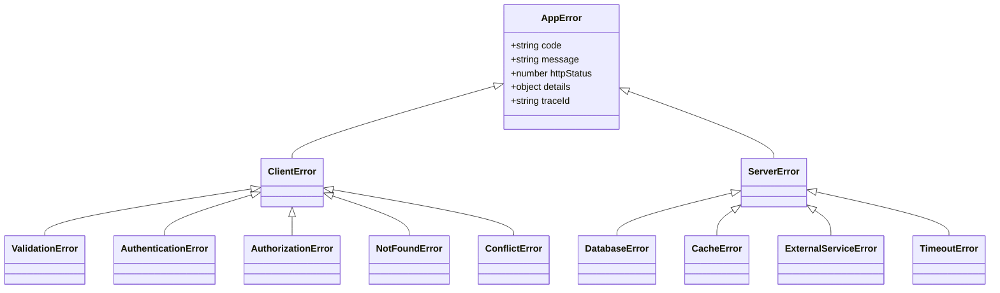

# CommerSync Error Handling Handbook

> **Document Status:** Approved  
> **Version:** 1.0.0  
> **Audience:** All Engineers, Staff Engineers, Tech Leads, SREs, New Hires  
> **Applies To:** Entire CommerSync Platform (Microservices, Frontend Apps,
> Shared Libraries, Async Workers)

---

## Executive Summary

In a distributed, event-driven microservices architecture like CommerSync, error
handling is not a local implementation detail; it is a **tier-1 system
property**. When an error occurs in a microservice downstream, it can propagate,
trigger timeouts, cascade into other systems, and ultimately degrade user
experience.

Consistent error handling directly impacts:

- **Business Success:** Correctly distinguishing between transient issues
  (retryable) and functional errors prevents lost revenue (e.g., failing a
  checkout because of a transient card check instead of retrying).
- **Developer Productivity:** A unified error format means developer tools,
  clients, and internal monitors use identical parsing logic.
- **Observability & Incident Response:** Standardized response envelopes, unique
  error codes, and correlation IDs cut Mean Time to Resolution (MTTR) by
  allowing SREs to trace a request's entire journey across 15+ services.

---

## 1. Error Handling Philosophy

### 1.1 Fail Fast

- **Rule:** Validate input parameters, preconditions, state, and credentials at
  the outermost boundaries of functions and services, and reject requests
  immediately if validation fails.
- **Why:** Executing business logic or database operations with invalid states
  wastes CPU cycles, risks corrupting data store states, and complicates debug
  logs.
- **Good Example:** Checking if a product has enough inventory _before_
  initializing payment transactions.
- **Bad Example:** Attempting to charge a customer's credit card and only
  checking inventory quantities when saving the order.

### 1.2 Fail Safely

- **Rule:** When a transaction or operation fails, ensure the system rolls back
  any intermediate state changes, releases resources (e.g., locks, db
  connections), and remains in a consistent state.
- **Why:** Unhandled errors that leave partial database state changes (e.g.,
  payment processed but order not saved) require manual reconciliation.

### 1.3 Never Expose Internal Implementation

- **Rule:** Raw exception details, database queries, file paths, and environment
  settings must never cross the service boundary.
- **Why:** Exposing internals leaks system vulnerabilities (e.g., PostgreSQL
  query layouts, stack traces) to malicious actors.

### 1.4 Predictable Error Contracts

- **Rule:** Errors are part of a service's public API contract. All possible
  error responses must be documented in Swagger/OpenAPI schemas.
- **Why:** Clients must know exactly how to handle expected functional failures
  (e.g., "card declined", "out of stock") to provide clean user feedback.

### 1.5 Machine-Readable & Human-Readable

- **Rule:** Every error must contain a specific machine-readable code (e.g.,
  `INSUFFICIENT_STOCK`) alongside a human-friendly message.
- **Why:** Frontend code uses the code to decide on routing, state updates, or
  translations, while logs use the message for developer debugging.

---

## 2. Error Classification

We classify errors into distinct categories to standardize HTTP mapping and
recovery strategies:

| Classification         | Purpose                                                    | HTTP Status                 | Recovery Strategy                                    |
| ---------------------- | ---------------------------------------------------------- | --------------------------- | ---------------------------------------------------- |
| **Validation**         | Incoming request payload contains invalid types or formats | `422 Unprocessable Entity`  | Stop request; present field errors to user           |
| **Authentication**     | Missing or invalid auth token                              | `401 Unauthorized`          | Prompt user to log in again                          |
| **Authorization**      | User authenticated but lacks required permission           | `403 Forbidden`             | Block action; display access error                   |
| **Resource Not Found** | Target resource ID does not exist                          | `404 Not Found`             | Update UI to reflect missing item                    |
| **Conflict**           | Resource state has changed (e.g., optimistic lock clash)   | `409 Conflict`              | Prompt user to refresh state and retry               |
| **Business Rule**      | Action violates domain invariants (e.g., coupon expired)   | `422 Unprocessable Entity`  | Present actionable message                           |
| **Rate Limiting**      | Client exceeded request quota                              | `429 Too Many Requests`     | Back off; retry after duration                       |
| **Database Failure**   | Database constraint violation or query timeout             | `500 Internal Server Error` | Log error; trigger circuit breaker if persistent     |
| **Dependency Failure** | Upstream API down or returning errors                      | `502 Bad Gateway`           | Use cached fallback if available; retry if transient |
| **Timeout**            | Operation exceeded max processing duration                 | `504 Gateway Timeout`       | Retry if safe (idempotent operations only)           |

---

## 3. Error Class Hierarchy

To ensure consistent typing and error propagation, all custom errors must
inherit from the base `AppError` class:



### Why the Hierarchy Exists

Inheritance allows our global error-handling middlewares to handle errors
polymorphically. The middleware can intercept any subclass of `AppError`, read
its `httpStatus` and serialization properties, and construct the JSON envelope
automatically, without having to check individual types.

---

## 4. Error Code Standards

### Rules for Codes

- **Format:** Codes must follow the pattern: `<SERVICE_PREFIX>_<NUMBER>` or
  `<SERVICE_PREFIX>_<STANDARD_VERB>`.
- **Uniqueness:** Once a code is defined, it must never be reused for a
  different scenario.
- **Deprecation:** Deprecated codes must be explicitly documented and not
  deleted from the code registry to maintain historical log searches.

### Standard Service Prefixes

- `AUTH_`: Authentication & Authorization
- `PROD_`: Product Catalog Service
- `ORD_`: Order Management Service
- `PAY_`: Payment Gateway integration
- `SYS_`: Internal server/system issues

---

## 5. Standard Error Response Envelope

Every HTTP error response returned by any CommerSync service must match the
following JSON envelope structure:

```json
{
  "success": false,
  "error": {
    "code": "PRODUCT_NOT_FOUND",
    "message": "The product with ID '123' was not found in the catalog.",
    "traceId": "c9281a8b-1e82-411a-8b82-99ca2f07293b",
    "details": {},
    "timestamp": "2026-07-13T10:00:00.000Z",
    "documentation": "https://docs.commersync.com/errors/PRODUCT_NOT_FOUND"
  }
}
```

### Field Definitions:

- `code` (Machine-readable): Used by client code to trigger conditional flows or
  lookup localized text.
- `message` (Human-readable): Developer-facing summary of what went wrong.
- `traceId` (Correlation ID): Shared trace token across CloudWatch logs.
- `details`: Arbitrary object containing structured contextual payload (e.g.,
  field validation issues).

---

## 6. Validation Error Format

When a payload fails input validation (e.g., Zod schema parsing), the `details`
field must contain a structured list of validation errors:

```json
{
  "success": false,
  "error": {
    "code": "VALIDATION_FAILED",
    "message": "Invalid request payload parameters.",
    "traceId": "c9281a8b-1e82-411a-8b82-99ca2f07293b",
    "details": {
      "errors": [
        {
          "field": "price",
          "message": "Price must be a positive number",
          "value": -10
        },
        {
          "field": "images[0]",
          "message": "Invalid image URL format",
          "value": "invalid-url"
        }
      ]
    },
    "timestamp": "2026-07-13T10:00:00.000Z"
  }
}
```

---

## 7. Exception Handling Strategy

### 7.1 Separation by Layer

```
+---------------------------------------------------------+
|                    Controller Layer                     |
|  - Intercept AppErrors, return JSON Envelope            |
|  - Catch unexpected errors, wrap in ServerError (500)   |
+---------------------------+-----------------------------+
                            |
+---------------------------v-----------------------------+
|                      Service Layer                      |
|  - Validate business rules                              |
|  - Throw functional ClientErrors (e.g. NotFoundError)    |
|  - Wrap downstream database exceptions                  |
+---------------------------+-----------------------------+
                            |
+---------------------------v-----------------------------+
|                    Repository Layer                     |
|  - Catch raw DB exceptions                              |
|  - Translate constraints into DatabaseError             |
+---------------------------------------------------------+
```

### 7.2 Throwing, Wrapping, and Re-throwing

- **Rule:** When catching low-level errors (like Prisma DB errors or Axios
  network errors), **never** re-throw them directly. Wrap them in a typed custom
  subclass of `AppError` and pass the original error as the `cause` property to
  preserve stack traces.
- **Why:** Prevents leaky abstractions. A service should not crash because of a
  raw database driver exception; it should receive a parsed, structured domain
  error.

#### Good Example

```typescript
try {
  await prisma.product.create({ data });
} catch (error) {
  throw new DatabaseError("Failed to save product to database", {
    cause: error,
  });
}
```

#### Bad Example

```typescript
try {
  await prisma.product.create({ data });
} catch (error) {
  // Leaks Prisma internals and stack context directly to caller
  throw error;
}
```

---

## 8. Logging Strategy

### 8.1 What to Log

- Every unhandled exception (`5xx` errors) must be logged with `level: error`
  and include the complete stack trace and `traceId`.
- Operational failures (`4xx` client errors) should be logged with `level: info`
  or `level: warn`. They do not require a full stack trace.

### 8.2 What NOT to Log (PII Masking)

- **Rule:** Never write personally identifiable information (PII) or secrets to
  the console or log storage.
- **Banned Fields:** Password properties, JWT keys, credit card numbers, auth
  tokens, refresh tokens.

---

## 9. Security Rules: Information Leakage

### Rule

Disable stack traces in error envelopes in production.

- **Why:** Stack traces expose the folder layout, library dependencies, and
  potential coding flaws.
- **Enforcement:**

```typescript
const responseEnvelope = {
  success: false,
  error: {
    code: error.code,
    message: error.message,
    traceId: error.traceId,
    // stack is only appended if NODE_ENV !== "production"
    ...(process.env.NODE_ENV !== "production" && { stack: error.stack }),
  },
};
```

---

## 10. Retry Strategy

Not all failures are equal. We separate errors into **Transient** (network
glitches, lock timeouts) and **Permanent** (validation errors, invalid
permissions).

### Rules for Retries

- **Only retry transient errors** (`503 Service Unavailable`,
  `504 Gateway Timeout`, network drops).
- **Always use exponential backoff with jitter** to avoid overwhelming
  downstream services (thundering herd problem).
- **Require Idempotency Keys** on the destination endpoint for any POST request
  retry.

---

## 11. Event-Driven Systems & Kafka Handling

### Dead Letter Queues (DLQ)

When a Kafka consumer fails to parse an event (e.g., schema mismatch) or
encounters a permanent logic error:

1. **Never** block the queue thread (poison message).
2. Commit the offset so execution continues.
3. Publish the bad message to a Dead Letter Queue (e.g., `<topic-name>-dlq`)
   with metadata containing the failure details for manual review.

---

## 12. Decision Matrix

| Situation                  | Recommended Error Type | HTTP Status                 | Error Code                | Retry?        | Log Level |
| -------------------------- | ---------------------- | --------------------------- | ------------------------- | ------------- | --------- |
| Invalid JSON body payload  | `ValidationError`      | `400 Bad Request`           | `VALIDATION_FAILED`       | No            | Info      |
| JWT validation expired     | `AuthenticationError`  | `401 Unauthorized`          | `TOKEN_EXPIRED`           | No            | Info      |
| Duplicate email on sign-up | `ConflictError`        | `409 Conflict`              | `EMAIL_ALREADY_EXISTS`    | No            | Info      |
| PostgreSQL lock timeout    | `DatabaseError`        | `500 Internal Server Error` | `DATABASE_ERROR`          | Yes (max 3)   | Error     |
| Stripe API timed out       | `ExternalServiceError` | `502 Bad Gateway`           | `PAYMENT_GATEWAY_TIMEOUT` | Yes (if safe) | Warn      |

---

## 13. Quick Reference Cheat Sheet

- **Rule 1:** Inherit from `AppError` for all custom exceptions.
- **Rule 2:** Prefix errors: `4xx` errors are `ClientError` (warn/info log),
  `5xx` errors are `ServerError` (error log + stack trace).
- **Rule 3:** Wrap low-level database/caching exceptions before propagating them
  up the stack.
- **Rule 4:** Return standard JSON error envelopes with machine-readable error
  codes.
