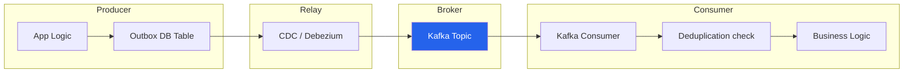
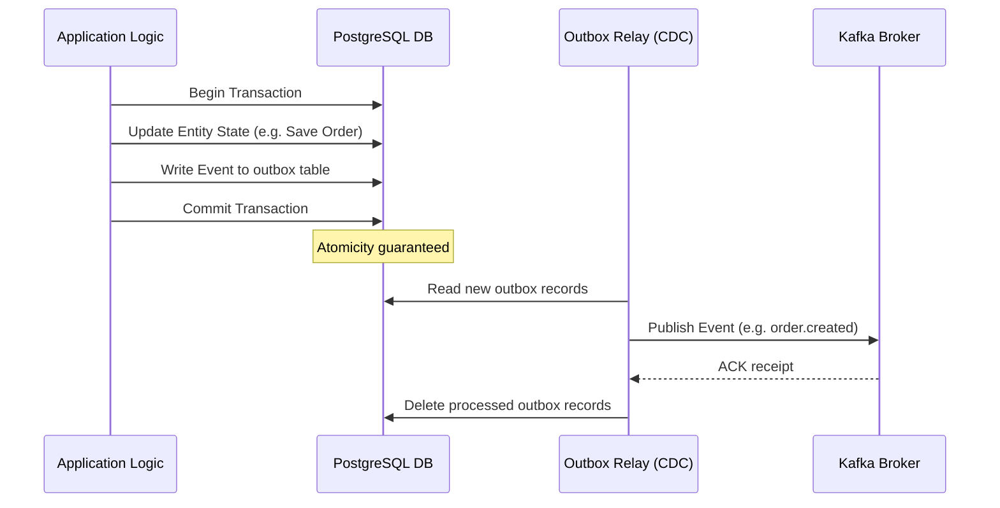
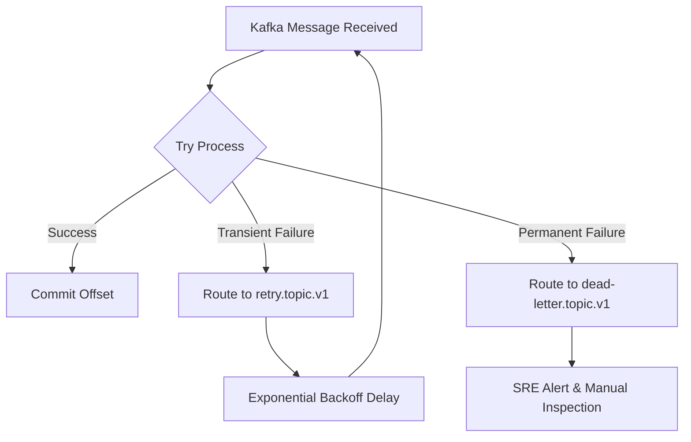

# CommerSync Event Schema & Messaging Standards Handbook

> **Document Status:** Approved  
> **Version:** 1.0.0  
> **Audience:** All Engineers, Distributed Systems Architects, Event-Driven
> Architecture Leads  
> **Applies To:** Entire CommerSync Platform (Kafka topics, Event Producers,
> Event Consumers, Event Payloads)

---

## Executive Summary

In a distributed microservices system consisting of 15+ backend services,
event-driven architecture (EDA) is the primary design pattern for loose
coupling, high availability, and scalability. However, without strict event
contracts and topic standards, EDA quickly devolves into an unstable
"distributed monolith," where downstream consumers crash when upstream producers
modify event shapes.

This handbook establishes the naming conventions, standard envelopes, versioning
strategies, and processing guidelines for all messaging across CommerSync.

---

## 1. Event Design Philosophy

### 1.1 Events Represent Facts, Not Commands

- **Rule:** An event must represent an immutable fact that has occurred in the
  past (e.g., `OrderCreated`). It must not represent a command or directive
  (e.g., `CreateOrder`).
- **Why:** Commands have target recipients and expect outcomes. Events simply
  report facts, allowing any consumer to react without the producer knowing who
  they are.

### 1.2 Events are Immutable

- **Rule:** Once published to a message broker, an event cannot be modified,
  deleted, or reordered.
- **Why:** Immutability ensures the log of truth is deterministic, enabling
  reliable event replay and consistent downstream updates.

### 1.3 Schema-First Design

- **Rule:** Before writing any code that publishes or consumes an event, the
  event schema must be defined in the schema registry and validated for
  compatibility.
- **Why:** Schema-first design guarantees event contracts are respected and
  prevents type drifts between producers and consumers.

### 1.4 Idempotent Processing

- **Rule:** Consumers must assume they will receive duplicate events
  (At-Least-Once Delivery) and must implement idempotency checks before writing
  state changes.
- **Why:** Network blips, broker restarts, or client reconnections can cause
  duplicate delivery of events that were already processed.

---

## 2. Event Types

We organize messaging into distinct event types:

| Event Type             | Purpose                                                       | Ownership            | Consumer Scope                |
| ---------------------- | ------------------------------------------------------------- | -------------------- | ----------------------------- |
| **Domain Event**       | Captures state changes within a single microservice boundary  | Owning Microservice  | Internal to that service only |
| **Integration Event**  | Shared data contract exposing state changes to other services | Owning Microservice  | Any authorized service        |
| **Audit Event**        | Immutable record of user actions for security and compliance  | Security/Audit       | Log search / Audit DB         |
| **Notification Event** | High-level user-facing notification trigger                   | Notification Service | Notification engine           |

---

## 3. Event & Topic Naming Standards

### 3.1 Event Naming

- **Rule:** Event names must be lowercase, use dot-separated namespace scopes,
  and use past-tense verbs for the action: `<domain>.<resource>.<action>`.
- **Good Examples:** `order.orders.created`, `payment.payments.failed`
- **Bad Examples:** `createOrder` (command), `orders_updated` (missing domains)

### 3.2 Topic Naming

- **Rule:** Kafka topic names must use the format:
  `<environment>.<service-domain>.<resource-name>.<version>`.
- **Good Examples:** `production.order-service.orders.v1`,
  `dev.payment-service.transactions.v1`
- **Bad Examples:** `test_topic`, `orders-v1`

---

## 4. Standard Event Envelope

Every event published to any CommerSync topic must follow this standard JSON
envelope structure:

```json
{
  "eventId": "e9281a8b-1e82-411a-8b82-99ca2f07293b",
  "eventType": "order.orders.created",
  "eventVersion": 1,
  "occurredAt": "2026-07-13T10:00:00.000Z",
  "producer": {
    "service": "order-service",
    "version": "1.2.0"
  },
  "trace": {
    "traceId": "c9281a8b-1e82-411a-8b82-99ca2f07293b",
    "correlationId": "corr-8712b87",
    "requestId": "req-998a12c"
  },
  "tenantId": "tenant-default",
  "payload": {},
  "metadata": {}
}
```

### Envelope Fields:

- `eventId` (UUID): Unique identifier for this specific event instance (used for
  deduplication).
- `eventType`: Dot-separated event namespace identifier.
- `eventVersion`: Positive integer representing the schema definition version.
- `occurredAt`: ISO 8601 UTC timestamp when the event was generated.
- `trace`: Structured correlation context (essential for
  [Logging Standards](file:///Users/Projects/CommerSync/docs/engineering/logging-standards.md#L41)).
- `payload`: The event-specific business data.

---

## 5. Schema Evolution & Versioning

### Rule

All updates to schemas must maintain **backward compatibility**. If a breaking
schema change is necessary, the producer must publish to a new topic (e.g.,
`<topic>.v2`) rather than modifying the current one.

### Non-Breaking Changes (Allowed in same version):

- Adding new optional fields.
- Adding nullable fields.

### Breaking Changes (Requires new topic version):

- Removing an existing field.
- Changing a field's data type.
- Adding a required field without a default value.

---

## 6. Architecture Flow & Patterns

### 6.1 Event Lifecycle Pipeline



### 6.2 Transactional Outbox Pattern

- **Rule:** Microservices must write state changes and the corresponding event
  payload to the same database transaction. A separate relay process (Change
  Data Capture/Debezium) reads the outbox table and publishes events to Kafka.
- **Why:** Writing to the database and publishing to Kafka without a shared
  transaction risks data inconsistency if one operation succeeds but the other
  fails.



### 6.3 Retry and Dead Letter Queue (DLQ) Flow

When event processing fails:



---

## 7. Partitioning & Ordering Strategy

- **Rule:** Standardize on **Entity Aggregate ID** as the partition key. All
  events related to the same entity (e.g., a specific `order_id`) must use the
  same key.
- **Why:** Kafka guarantees order preservation _only within a single partition_.
  Using the aggregate ID as the key ensures that all events for a specific
  resource (e.g., order created -> order processing -> order shipped) are
  processed in the correct order.

---

## 8. Consumer Standards

- **Idempotency / Deduplication:** Consumers must store processed `eventId`
  values in a database table or Redis cache, and skip execution if an incoming
  event's ID matches a record.
- **Graceful Shutdown:** Consumer services must listen for termination signals
  (`SIGTERM`, `SIGINT`), stop polling Kafka, process outstanding messages,
  commit offsets, and exit.

---

## 9. Quick Reference Cheat Sheet

- **Rule 1:** Use `snake_case` dot-notation for event names
  (`order.orders.created`).
- **Rule 2:** Topic names follow: `<env>.<service>.<resource>.<version>`.
- **Rule 3:** All events must include `traceId` and `correlationId` in the
  envelope.
- **Rule 4:** Standardize on the Transactional Outbox Pattern; never publish
  directly to Kafka inside HTTP routes.
- **Rule 5:** Partition using aggregate ID keys (e.g., `orderId`) to preserve
  order.
- **Rule 6:** Never block consumers on poison messages; route to Dead Letter
  Queue (DLQ).
- **Rule 7:** PII in event payloads must be encrypted or masked (GDPR/PCI
  compliance).
