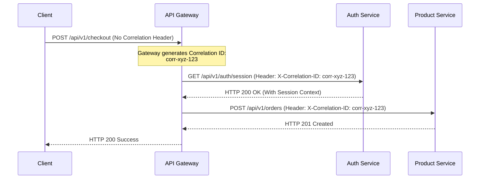

# CommerSync Structured Logging Handbook

> **Document Status:** Approved  
> **Version:** 1.0.0  
> **Audience:** All Engineers, Staff Engineers, Tech Leads, SREs, New Hires  
> **Applies To:** Entire CommerSync Platform (Microservices, Next.js Apps,
> Shared Libraries, Async Workers, Infrastructure)

---

## Executive Summary

In a large-scale enterprise system with 15+ backend microservices handling
millions of operations daily, traditional text-based logging (`console.log`) is
an anti-pattern. Structured logging transforms logs from unstructured string
payloads into high-fidelity, machine-readable JSON documents.

Structured logging directly impacts:

- **Production Debugging & Incident Response:** SREs can immediately isolate
  logs across the entire monorepo using standard fields (`traceId`, `userId`,
  `service`).
- **Observability & Analytics:** Centralized systems (e.g., Datadog, ELK,
  CloudWatch) can index, parse, and aggregate JSON fields natively without
  resource-heavy regular expressions.
- **Performance:** Structured logs use optimized serializers (e.g., Pino) to
  avoid the main event-loop blocking associated with traditional synchronous
  stdout operations.

---

## 1. Logging Philosophy

### 1.1 Logs are for Machines First, Humans Second

- **Rule:** Every log must be emitted as a single line of structured JSON. Plain
  text strings are prohibited in production.
- **Why:** Indexing engines parse JSON properties natively. Searching plain text
  with regex is slow and cannot support aggregations.

### 1.2 Every Request Must be Traceable

- **Rule:** Every log statement executed during a request must contain a
  `traceId` and `correlationId`.
- **Why:** Without trace propagation, it is impossible to reconstruct the
  chronological flow of a request as it hops between services.

### 1.3 Every Log Should Answer a Question

- **Rule:** Do not write logs without context. Every log must answer: _What
  happened? When did it happen? In what context? What was the outcome?_
- **Why:** Log spam ("entering function", "exiting function") increases storage
  costs without adding diagnostic value.

### 1.4 Never Log Sensitive Information

- **Rule:** Sensitive data (passwords, tokens, PII, payment info) must be
  stripped or masked before the log leaves the application memory space.
- **Why:** Exposing secrets in log storage violates security standards (SOC2,
  PCI-DSS) and compromises customer privacy.

---

## 2. Log Levels

We define a strict standard for using log levels:

| Level     | Purpose                                               | Production Action  | Example                                                  |
| --------- | ----------------------------------------------------- | ------------------ | -------------------------------------------------------- |
| **TRACE** | Highly verbose diagnostic tracing details             | Disabled (Default) | Logging raw database execution query objects             |
| **DEBUG** | Diagnostic insights for developer debugging           | Disabled (Default) | Payload structure received from a web hook callback      |
| **INFO**  | Core system milestones and business events            | Enabled (Default)  | User logged in, order completed, startup completed       |
| **WARN**  | Non-critical operational anomalies                    | Enabled (Default)  | Cache connection lost (retrying), request throttled      |
| **ERROR** | Actionable failure in a single operation              | Enabled (Default)  | Unhandled API route rejection, payment gateway timeout   |
| **FATAL** | Critical infrastructure failure causing service crash | Enabled (Default)  | Server cannot bind to port, missing database credentials |

---

## 3. Standard Log Schema

Every log emitted by any CommerSync service must follow this JSON schema:

```json
{
  "timestamp": "2026-07-13T10:00:00.000Z",
  "level": "INFO",
  "service": "product-service",
  "environment": "production",
  "version": "1.4.0",
  "traceId": "c9281a8b-1e82-411a-8b82-99ca2f07293b",
  "requestId": "req-998a12c",
  "correlationId": "corr-8712b87",
  "userId": "usr_90a182b",
  "operation": "get_product_by_id",
  "message": "Product retrieved successfully from database",
  "durationMs": 12,
  "metadata": {
    "productId": "prod_7718",
    "cacheHit": false
  }
}
```

### Schema Properties:

- `timestamp` (ISO 8601): Mandatory, UTC timezone format.
- `level`: Uppercase string level (`DEBUG`, `INFO`, etc.).
- `service`: The microservice identifier (e.g., `auth-service`,
  `product-service`).
- `traceId`: Auto-propagated trace identifier for distributed tracing
  (OpenTelemetry compatible).
- `correlationId`: Correlation identifier spanning multiple downstream systems.
- `metadata`: Arbitrary payload containing domain context metrics.

---

## 4. Distributed Tracing & Correlation IDs

### 4.1 Correlation ID vs. Request ID vs. Trace ID

- **Request ID:** Identifies a single HTTP request lifecycle between a client
  and a specific service (e.g., API Gateway to Auth Service).
- **Correlation ID:** Connects multiple distinct operations that are part of the
  same logical business flow (e.g., placing an order, charging a card, sending
  an email).
- **Trace ID:** OpenTelemetry standard representing a single request execution
  path across distributed services.

### 4.2 Correlation ID Propagation Flow



### 4.3 Kafka Propagation

Event producers must inject the `correlationId` into the **Kafka Record
Headers**, allowing consumer services to read it and enrich their logging
context before processing the event payload.

---

## 5. Logging in Each Layer

### 5.1 API Gateway

- **Log:** Route matches, client IP, raw URL, response HTTP status code,
  latency.
- **Do NOT Log:** Client authorization headers, query parameters containing
  sensitive names.

### 5.2 Controllers & Route Handlers

- **Log:** Endpoint match, parsed arguments (sanitized), operation duration.
- **Level:** `INFO` for standard routes, `WARN` for client failures (`4xx`).

### 5.3 Services (Business Logic)

- **Log:** Invariant checks, business transitions (e.g., "Order transition to
  SHIPPED").
- **Level:** `INFO`.

### 5.4 Repositories & Database Layer

- **Log:** Query execution time, connection timeouts.
- **Level:** `DEBUG` (except slow queries exceeding $200\text{ms}$ which must be
  logged at `WARN`).

---

## 6. Business Event Logging (Audit Trail)

Business events represent permanent transactional audit milestones. They must be
logged at `INFO` with specific entity schemas:

```json
{
  "timestamp": "2026-07-13T10:00:00.000Z",
  "level": "INFO",
  "service": "order-service",
  "operation": "order_completed",
  "message": "Order completed successfully",
  "userId": "usr_90a",
  "metadata": {
    "orderId": "ord_881a7",
    "totalAmount": 150.5,
    "paymentMethod": "stripe"
  }
}
```

---

## 7. Performance & Latency Thresholds

Log slow operations at `WARN` when they exceed these FAANG-scale thresholds:

- **Database Queries:** $> 200\text{ms}$
- **Cache Execution:** $> 20\text{ms}$
- **External API Calls (e.g., Stripe):** $> 1000\text{ms}$
- **Background Workers:** $> 5000\text{ms}$

---

## 8. PII & Sensitive Data Masking Policy

### Banned Fields (Must Never Be Logged)

- `password`
- `token` / `refreshToken`
- `cardNumber` / `cvv`
- `jwt`
- `apiKey`

### Masked Fields (Must Be Obfuscated)

- `email` -> `t***@example.com`
- `phone` -> `+1*****1234`

#### Masking Helper

```typescript
export function maskEmail(email: string): string {
  const [local, domain] = email.split("@");
  if (!local || !domain) return "***";
  return `${local[0]}***@${domain}`;
}
```

---

## 9. Observability Integration

- **OpenTelemetry:** Trace IDs are mapped natively to standard OpenTelemetry
  attributes (`trace_id`).
- **CloudWatch/Datadog:** JSON formatted logs on stdout are collected by agents,
  parsed as structured attributes, and indexed automatically for searching.

---

## 10. Logging Anti-Patterns

### Anti-Pattern 1: console.log()

- **Bad:** `console.log("Saving user profile: " + name);`
- **Good:** `logger.info({ name }, "Saving user profile");`

### Anti-Pattern 2: String Concatenation (Performance cost)

- **Bad:** `logger.info("Retrieved product " + JSON.stringify(product));`
- **Good:** `logger.info({ productId: product.id }, "Retrieved product");`

---

## 11. Quick Reference Cheat Sheet

- **Rule 1:** Output structured JSON on stdout (no log files).
- **Rule 2:** Always propagate `traceId` and `correlationId` in HTTP and message
  broker headers.
- **Rule 3:** Never log raw credit cards, passwords, or access tokens.
- **Rule 4:** Slow queries ($>200\text{ms}$) must be logged as `WARN`.
- **Rule 5:** Non-production environments only enable levels up to `DEBUG` when
  debugging local features. Production default level is `INFO`.
